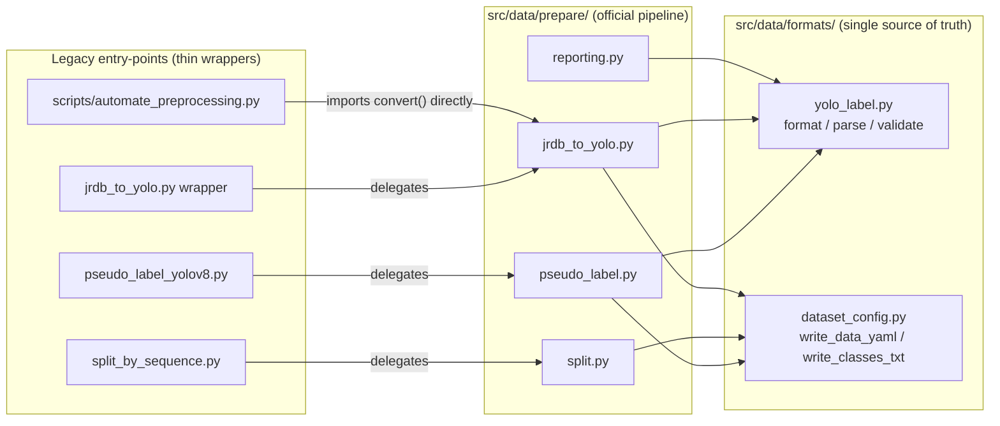
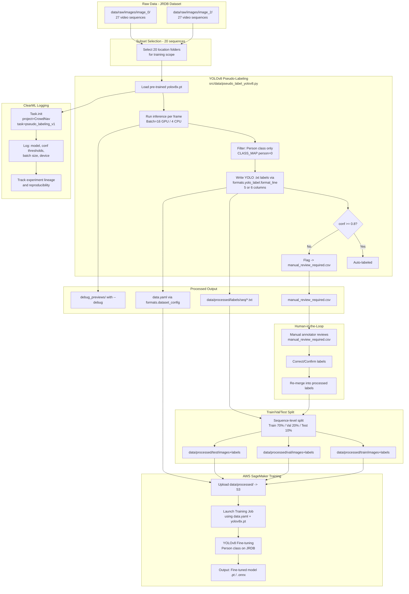

# Data Preprocessing Pipeline Diagram

이 문서는 CrowdNav 프로젝트의 전체 데이터 전처리 파이프라인을 다이어그램으로 설명합니다.  
**AWS SageMaker 팀**과 **ClearML 팀** 모두가 각자의 관여 지점을 명확하게 파악할 수 있도록 구성했습니다.

---

## 0. Package Architecture (New)



---

## 1. High-Level Overview



---

## 2. Detailed Step-by-Step Description

### Step 1 — Raw Data (JRDB Dataset)
| 항목 | 내용 |
|---|---|
| Source | JRDB (JackRabbot Dataset) — Stanford 캠퍼스 영상 |
| 카메라 위치 | `image_0` (정면), `image_2` (측면) |
| 구조 | 각 카메라 하위에 27개의 location/video 시퀀스 폴더 |
| 각 폴더 내용 | 비디오를 추출한 연속 프레임 이미지 (`.jpg`) |

> [!NOTE]
> `image_4`, `image_6`, `image_8`, `image_stitched`는 이번 학습 범위에서 제외. 삭제 완료.

---

### Step 2 — Subset Selection
- **목적:** 전체 27 시퀀스 중 20개만 선택하여 초기 학습 데이터 구축.
- **방식:** 현재는 `image_0`, `image_2` 전체를 대상으로 스크립트가 자동 순회.
- **미결 사항:** 20개 서브셋을 명시적으로 지정할 리스트(`sequence_subset.txt`)가 아직 없음. (향후 추가 필요)

---

### Step 3 — YOLOv8 Pseudo-Labeling (`pseudo_label_yolov8.py`)

```
For each sequence in image_0/, image_2/:
  For each frame batch (size=16 GPU / 4 CPU):
    → YOLOv8x.pt inference()
    → Filter: class=person only
    → For each detection:
        line = formats.yolo_label.format_line(class_id, x, y, w, h, track_id)
        if conf >= 0.8 → write to .txt label file
        else           → also write label BUT flag to manual_review_required.csv
    → After all sequences:
        → formats.dataset_config.write_data_yaml_from_class_map()
        → log to ClearML
```

**YOLO Label Format (`.txt`):**

| 컬럼 | 항목 | 설명 |
|---|---|---|
| 1 | `class_id` | 객체 클래스 (Person=0) |
| 2-5 | `x, y, w, h` | 0.0~1.0 사이로 정규화된 박스 좌표 |
| 6 | `track_id` | **(Extended, optional)** 추적된 고유 ID — `include_track_id` 옵션으로 제어 |

```
# Standard (5-col):
0 0.512000 0.634000 0.123400 0.245600

# Extended (6-col):
0 0.512000 0.634000 0.123400 0.245600 101
```
- 좌표는 이미지 크기 대비 상대 좌표입니다.
- `track_id`는 상황 인식(Situational Awareness) 단계에서 이동 경로 및 밀도 분석을 위해 사용됩니다.
- 라벨 포맷 파싱/검증은 `src/data/formats/yolo_label.py`에 집중되어 있습니다.

---

### Step 4 — ClearML Logging

> **ClearML 팀이 관여하는 구간입니다.**

ClearML은 스크립트 실행 시작과 동시에 자동으로 실험 정보를 기록합니다.

```python
task = Task.init(project_name="CrowdNav", task_name="pseudo_labeling_v1")
task.connect(vars(args))
```

| ClearML에서 추적되는 항목 | 값 예시 |
|---|---|
| `model` | `yolov8x.pt` |
| `conf_thresh` | `0.5` |
| `manual_thresh` | `0.8` |
| `device` | `cuda` / `cpu` |
| `batch_size` | `16` / `4` |

**확인 방법:** ClearML UI → Projects → CrowdNav → pseudo_labeling_v1

---

### Step 5 — Processed Output Files

| 파일 | 용도 |
|---|---|
| `data/processed/labels/<seq>/*.txt` | YOLO 학습용 라벨 파일 |
| `manual_review_required.csv` | 낮은 정확도 프레임 목록 (수동 검수 대상) |
| `data.yaml` | AWS SageMaker 학습 설정 파일 (formats.dataset_config으로 생성) |
| `debug_previews/*.jpg` | 시각적 검증용 이미지 (`--debug` 옵션 시) |

---

### Step 6 — Train/Val/Test Split (`split_by_sequence.py`)

> **AWS SageMaker 팀이 이 결과물을 사용합니다.**

```bash
# camera view별 실행 + --stem-prefix로 파일명 충돌 방지
python src/data/split_by_sequence.py \
  --src-labels data/processed/labels \
  --src-images data/raw/images/image_0 \
  --output-dir data/processed/splits \
  --stem-prefix image0 \
  --train-ratio 0.7 --val-ratio 0.2 --seed 42

python src/data/split_by_sequence.py \
  --src-labels data/processed/labels \
  --src-images data/raw/images/image_2 \
  --output-dir data/processed/splits \
  --stem-prefix image2 \
  --train-ratio 0.7 --val-ratio 0.2 --seed 42
```

분할 결과:
```
data/processed/splits/
  train/
    images/   ← 학습 이미지
    labels/   ← 학습 라벨
  val/
    images/
    labels/
  test/
    images/
    labels/
  data.yaml   ← SageMaker training config (formats.dataset_config으로 생성)
```

---

### Step 7 — AWS SageMaker Training

> **AWS SageMaker 팀이 관여하는 구간입니다.**

#### Path A: YOLO Training (Ultralytics)

1. `data/processed/splits/` 전체를 **S3 버킷에 업로드**합니다.
2. `data.yaml`의 `path:` 항목을 S3 경로로 업데이트합니다.
3. SageMaker Training Job 실행:

```python
# SageMaker에서 사용할 data.yaml 구조
path: s3://<your-bucket>/crowdnav/processed/splits
train: train/images
val: val/images
test: test/images
nc: 1
names: ["person"]
```

```bash
python deploy/train_skeleton.py \
  --model yolov8x.pt \
  --data s3://.../data.yaml \
  --epochs 50 \
  --imgsz 640
```

#### Path B: Keras Training (COCO JSON)

1. `data/processed/coco/*.json` + `data/processed/splits/{train,val,test}/images`를 S3로 업로드합니다.
2. SageMaker Training Job 실행 (Keras entry-point):

```bash
python deploy/train_keras_skeleton.py \
  --train-json /opt/ml/input/data/training/coco/train.json \
  --val-json /opt/ml/input/data/training/coco/val.json \
  --images-root /opt/ml/input/data/training/splits \
  --epochs 1 \
  --imgsz 640 \
  --batch 8
```

---

### Step 8 — Human-in-the-Loop (수동 검수)

`manual_review_required.csv` 형식:

```csv
image_path,lowest_confidence
data/raw/images/image_0/bytes-cafe-2019-02-07_0/frame_0001.jpg,0.612
data/raw/images/image_2/clark-center-2019-02-28_0/frame_0042.jpg,0.734
...
```

**작업 흐름:**
1. 파일을 열어 해당 이미지들을 검토합니다.
2. YOLO 라벨 파일을 직접 수정하거나 annotation 툴(예: LabelImg, Roboflow)에서 확인합니다.
3. 수정된 라벨을 `data/processed/labels/` 에 반영 후 split 단계를 재실행합니다.

---

## 3. 전체 데이터 흐름 요약

```
JRDB raw frames
    ↓
[pseudo_label_yolov8.py]  ← uses formats.yolo_label + formats.dataset_config
    ↓                          ↓
YOLO .txt labels         ClearML experiment log
    ↓
[split_by_sequence.py]    ← uses formats.dataset_config
    ↓
train / val / test splits + data.yaml
    ↓
S3 Upload
    ↓
[SageMaker Training Job]
    ↓
Fine-tuned YOLOv8 model (.pt / .onnx)
```
