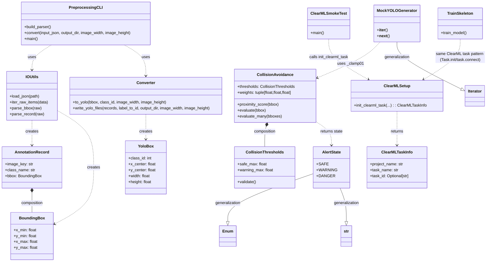
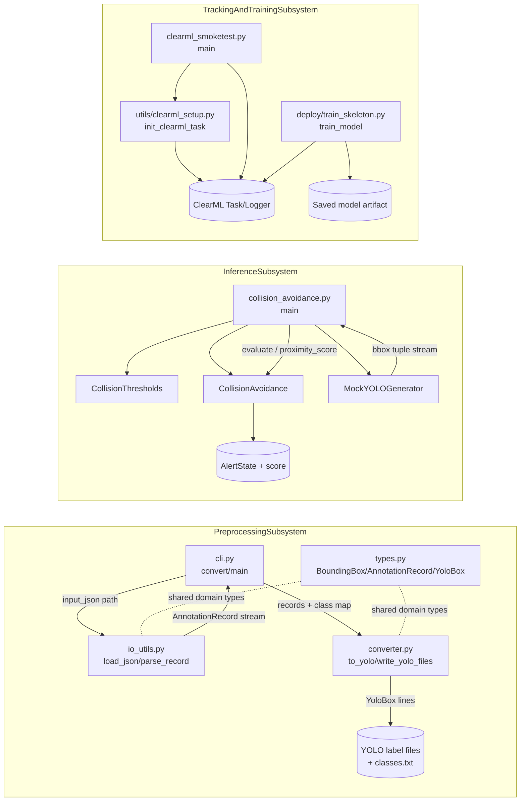
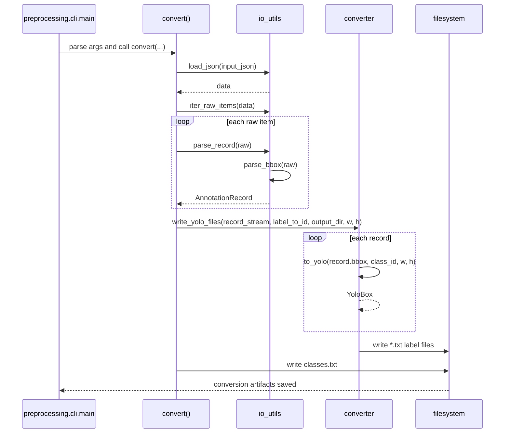

# System Architecture Documentation

## 1. Overview
This system currently has three implemented runtime areas in the latest remote default branch (`origin/master`):
- Data preprocessing pipeline for converting JRDB-style annotations into YOLO label files
- Collision-risk inference simulation pipeline
- ClearML integration for experiment/task tracking (plus a TensorFlow training skeleton)

The preprocessing side reads JSON, normalizes raw records into typed domain models, converts bounding boxes to YOLO format, and writes per-image label files with class mapping output. The inference side generates or accepts normalized bounding boxes, computes a proximity-based risk score, and maps that score to alert states. The ClearML side initializes tasks and logs metadata/metrics for training or smoke testing.

The architecture is split this way to keep concerns separate:
- Parsing/format conversion logic is isolated in preprocessing modules
- Runtime risk logic is isolated in inference classes
- Experiment tracking is isolated in utility/deploy entry points

## 2. Block Definition Diagram (BDD)

## 3. Internal Block Diagram (IBD)

## 4. Sequence Diagram

## 5. Notes & Assumptions
- `needs clarification`: Requested branch was `main`, but remote default branch after latest fetch is `master` and `origin/main` does not exist.
- Diagrams are generated from files in `origin/master` only.
- Some external services/libraries (ClearML server, TensorFlow runtime) are shown as external artifacts, not internal blocks.
