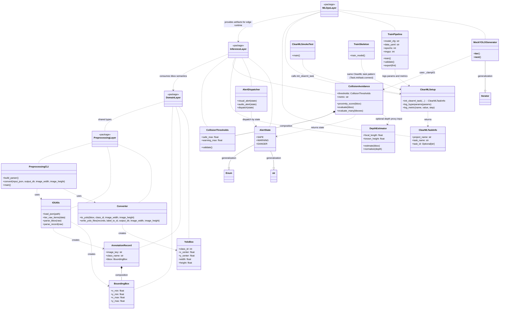
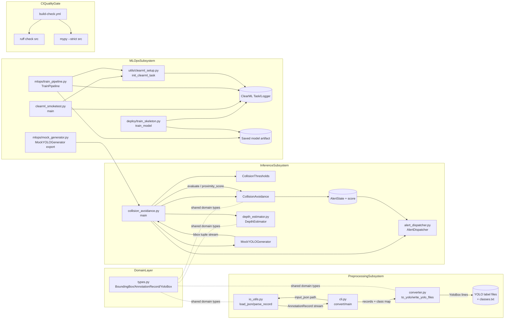
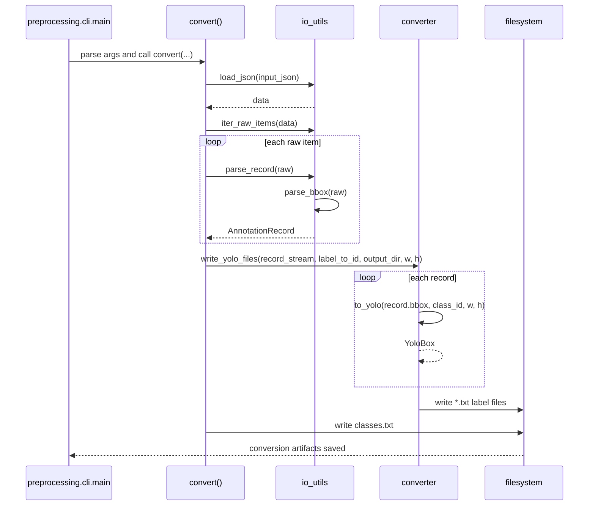

# System Architecture Documentation

## 1. Overview
This document reflects the current 4-layer CrowdNav scaffold in the latest feature branch and PR.

Implemented runtime areas:
- Domain layer for annotation and detection value objects
- Preprocessing layer for JRDB-style JSON parsing and YOLO label conversion
- Inference layer for proximity scoring and alert dispatching
- MLOps layer for tracking/training lifecycle scaffolds

The preprocessing layer reads JSON, normalizes raw records into typed domain models, converts bounding boxes to YOLO format, and writes per-image label files with class mapping output. The inference layer accepts normalized bounding boxes, computes proximity scores, estimates depth proxies, classifies risk states, and routes alerts. The MLOps layer exposes ClearML task setup and training/export pipeline scaffolds.

Separation goals:
- Parsing and format conversion remain in preprocessing modules
- Runtime risk and output routing remain in inference modules
- Experiment tracking and lifecycle orchestration remain in mlops/utils modules
- CI quality gates (ruff + mypy strict) validate Python quality in build workflows

## 2. Block Definition Diagram (BDD)


## 3. Internal Block Diagram (IBD)


## 4. Sequence Diagram


  ### Inference Runtime Sequence
  ```mermaid
  sequenceDiagram
    participant Cam as Edge Camera Frame
    participant Yolo as YOLOv8 Inference
    participant Depth as DepthEstimator
    participant Eval as CollisionAvoidance
    participant Alert as AlertDispatcher
    participant Log as Local Logger

    Cam->>Yolo: frame tensor
    Yolo-->>Eval: bbox list + confidence
    Eval->>Eval: confidence filter + proximity_score
    Eval->>Depth: estimate(bbox)
    Depth-->>Eval: normalized depth proxy
    Eval-->>Alert: AlertState (SAFE/WARNING/DANGER)
    Alert->>Alert: visual_alert / audio_alert
    Alert-->>Log: alert + frame stats
  ```

  ### Training and Export Sequence
  ```mermaid
  sequenceDiagram
    participant Prep as PreprocessingCLI
    participant Data as YOLO labels/data.yaml
    participant TP as TrainPipeline
    participant CM as ClearMLSetup
    participant Art as Model Artifacts

    Prep->>Data: convert JRDB JSON to labels
    TP->>CM: init_clearml_task()
    TP->>CM: log_hyperparams()
    loop epoch
      TP->>CM: log_metric(mAP50/val_loss)
    end
    TP->>TP: validate()
    TP->>Art: export(onnx/ncnn)
  ```

## 5. Notes & Assumptions
- Default branch for PRs is `main`; integration work may use `dev` (at time of last update).
- Diagram structure reflects current scaffold state: class-level interfaces may still raise `NotImplementedError` by design.
- `ruff check` passes; `mypy --strict` is integrated into CI and requires code-level type cleanup to pass consistently.
- External services (ClearML server/runtime dependencies) are modeled as external artifacts, not internal blocks.

## 6. Additional Updates Needed
- Replace remaining scaffold-only notes as modules become fully implemented.
- Add an explicit API contract diagram once frontend/backend interfaces are finalized.
- Add deployment view for Docker compose runtime under `deploy/`.
- Add metric lineage mapping between training logs and exported model artifacts.

## Review Request Guide
- List the exact diagrams updated (BDD, IBD, sequence).
- Link affected code modules for each diagram change.
- State if a diagram block is speculative or implemented.
- Confirm that naming in diagrams matches module/class names in code.
