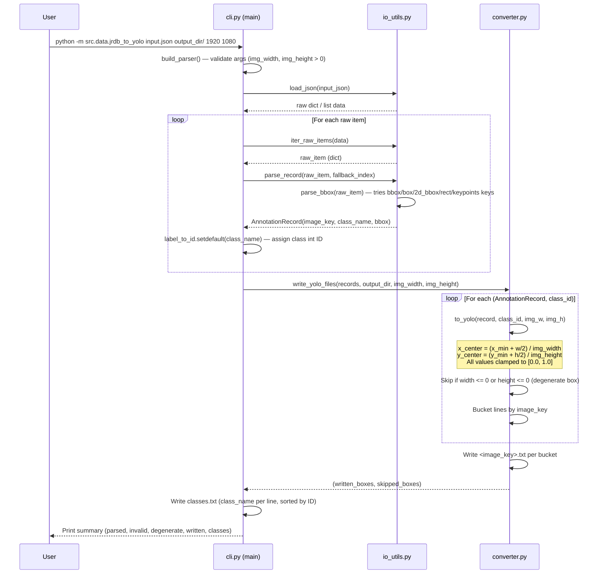

# JRDB to YOLO Preprocessing Module

This package handles conversion of **JRDB-style JSON annotation files** into YOLO `.txt` label files.  
It is used when ground-truth JSON annotations are available. For pseudo-labeling (model-generated labels), use `src/data/pseudo_label_yolov8.py` instead.

## Package Layout
```text
src/data/preprocessing/
  types.py       ← AnnotationRecord, BoundingBox, YoloBox dataclasses
  io_utils.py    ← JSON loading, raw item iteration, bbox + record parsing
  converter.py   ← Coordinate normalization (xyxy → YOLO xywh) and .txt file writing
  cli.py         ← CLI entrypoint, argument parsing, orchestration
```

---

## Sequence Diagram — JRDB JSON → YOLO Label Conversion



---

## CLI Entry

```bash
# Single JSON file
python -m src.data.jrdb_to_yolo <input_json> <output_dir> <img_width> <img_height>

# Example
python -m src.data.jrdb_to_yolo \
  data/raw/annotations/sequence_0.json \
  data/processed/labels/sequence_0 \
  1920 1080
```

## Behavior
- Parses JRDB-like JSON variants (list, or dict with `annotations`/`labels`/`items`/`frames` keys).
- Accepts multiple bbox key conventions: `bbox`, `box`, `2d_bbox`, `rect`, `x/y/w/h`, `x1/y1/x2/y2`, `keypoints`.
- Converts absolute `xyxy` boxes into YOLO normalized `xywh` format (values clamped to [0.0, 1.0]).
- Writes one `.txt` label file per image stem, plus a `classes.txt` mapping file.
- Skips malformed records (no valid bbox) and degenerate boxes (zero width or height), counting each.

## Batch Orchestration

`scripts/automate_preprocessing.py` runs conversion over multiple JSON files and validates output consistency.

```bash
python scripts/automate_preprocessing.py \
  data/raw/images/image_0 \
  data/raw/images/image_0 \
  data/processed/labels \
  1920 1080 \
  --recursive \
  --skip-dvc-pull
```

Validation modes:
- `--recursive` — traverse all subdirectories for JSON files and images
- `--validation-only` — check existing image/label pairs without running conversion
- `--dry-run` — show planned actions only

Generated report: `preprocessing_report.json` in output root.

## Review Request Guide
- Include one sample input JSON key format that was validated.
- Include aggregate skip counters (invalid and degenerate).
- Include classes mapping output (`classes.txt`) from your run.
- Include whether `--validation-only` or `--dry-run` mode was used.
- State image dimensions passed as `img_width` and `img_height`.
