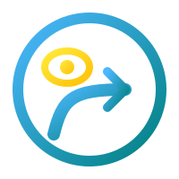
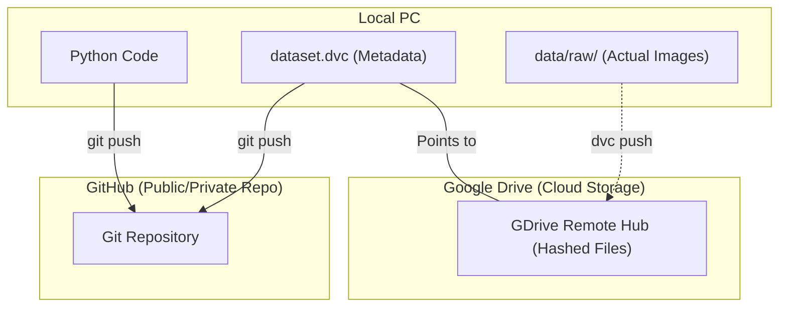

<p align="center">
  
  <h1 align="center">Crowd Detection and Accessibility Navigation</h1>
  <p align="center">
    <strong>Computer vision system for navigating crowded transport hubs.</strong>
    <br />
    <br />
    <a href="#project-abstract">Explore the docs</a>
    ·
    <a href="#faq">View FAQ</a>
    ·
    <a href="#contact">Contact</a>
  </p>
</p>

---


> A computer vision system that assists individuals with disabilities in navigating crowded transport hubs (airports, train stations, public spaces) using real-time obstacle detection and proximity logic.

## Environment Setup

```bash
# 1. Clone the repository
git clone <repo-url> && cd CrowdNav
git checkout develop

# 2. Create and activate a virtual environment
python -m venv .venv
.venv\Scripts\activate   # Windows
# source .venv/bin/activate  # macOS/Linux

# 3. Install dependencies
pip install -r requirements.txt
```

## ClearML (Experiment Tracking)

This project supports experiment tracking with **ClearML**.

### 1) One-time setup (per machine)

```bash
clearml-init
```

If you don't have a ClearML server, you can use the free ClearML hosting option during `clearml-init`, or set offline mode in your environment:

```bash
set CLEARML_OFFLINE_MODE=1
```

### 2) Smoke test (creates a Task and logs metrics)

```bash
python -m src.clearml_smoketest
```

## Data Version Control (DVC)

This project uses **DVC** with **Google Drive** as the remote storage for large datasets and model weights.

### DVC Workflow Overview



<details>
<summary><strong>한국어 안내 (접기/펼치기)</strong></summary>

### 1. 역할 분담 요약
*   **Git (GitHub):** 파이썬 코드, 프로젝트 문서, 그리고 데이터가 구글 드라이브의 어디에 어떤 버전으로 있는지 가리키는 **이름표(메타데이터, `*.dvc`)**만 관리합니다.
*   **DVC (Google Drive):** 수천 장의 YOLO 학습용 이미지, 라벨링 파일 등 실제 **무거운 알맹이 데이터**를 저장하고 보관합니다.

### 2. 구글 드라이브 내부 구조 (주의사항)
구글 드라이브 연동 폴더를 웹 브라우저로 확인하면 `images/`, `labels/` 같은 직관적인 구조 대신 `4f/`, `a2/` 같은 해시(Hash) 값 폴더들만 보입니다.
> [!WARNING]
> **절대로 구글 드라이브 웹사이트에서 직접 파일을 수정하거나 이동하지 마세요.**
> DVC는 버전 관리를 위해 데이터를 최적화된 방식(캐시)으로 변환하여 저장합니다. 데이터 업로드/다운로드는 오직 `dvc push`, `dvc pull` 명령어를 통해서만 수행해야 합니다.

### 3. 실제 협업 흐름 (POV 데이터 추가 예시)
팀원이 새로운 POV 이미지 100장을 추가하는 과정은 다음과 같습니다:
1.  **로컬 추가:** 새로운 이미지를 `data/raw/`에 넣습니다.
2.  **데이터 트래킹:** `dvc add data/raw`를 실행하면 실제 데이터는 구글 드라이브로 올라갈 준비를 하고, 로컬의 `data/raw.dvc` 파일(포인터)이 업데이트됩니다.
3.  **데이터 업로드:** `dvc push`를 통해 무거운 데이터만 구글 드라이브 창고로 바로 쏩니다.
4.  ** Git 공유:** 가벼운 `data/raw.dvc` 파일만 `git commit` 후 GitHub에 올립니다.
5.  **팀원 수령:** 다른 팀원이 `git pull` 후 `dvc pull`을 치면, 지알아서 구글 드라이브 창고에서 최신 데이터를 다운로드하여 로컬 폴더를 동기화합니다.

</details>

### Pulling Data (Most Common)
```bash
# Download datasets & models from Google Drive
dvc pull
```
> **Note:** On the first run, a browser window will open for Google authentication. Log in with the Google account that has access to the shared Drive folder.

### Pushing Data (After Adding/Updating Datasets)
```bash
# 1. Track new or updated data with DVC
dvc add data/raw
dvc add data/processed
dvc add models/

# 2. Commit the metadata files to Git
git add data/raw.dvc data/processed.dvc models.dvc .gitignore
git commit -m "Update dataset v2"

# 3. Upload the actual data to Google Drive
dvc push

# 4. Push Git changes
git push origin develop
```

### For New Team Members
1. Ask the project owner to share the Google Drive folder with your Google account (Editor access).
2. Clone the repo, install dependencies, then run `dvc pull`.
3. Authenticate via the browser popup — data will be downloaded automatically.

<details>
<summary><strong>Table of Contents</strong></summary>

- [Team Members](#team-members)
- [Project Abstract](#project-abstract)
- [Additional Support Required](#additional-support-required)
- [Repository Layout](#repository-layout)
- [Submission Summary](#submission-summary)
- [File Naming Convention](#file-naming-convention)
- [Key Rules](#key-rules)
- [FAQ](#faq)
- [Contact](#contact)
</details>

---

## Team Members

| Name | Student ID | Role (Equally Distributed DL Workload) |
|------|------------|-----------------------------------------|
| TBD  | TBD        | **Data Engineering & Preprocessing:** Dataset curation (JRDB), POV filtering, and augmentation strategies for wheelchair perspective. |
| Jungwook Van | 25167747 | **YOLO Transfer Learning (Team Lead):** Fine-tuning YOLO v8/v10 for target classes, model optimization, and latency benchmarking. |
| TBD  | TBD        | **Inference Logic & Thresholding:** Developing bounding-box scaling heuristics for proximity estimation and building the alerting pipeline. |

> **Note:** The specific role assignments above are tentative and will be finalized after further team discussion.

---

## Project Abstract

Navigating densely populated transport hubs presents significant barriers to safe and independent travel for individuals with mobility disabilities. In dynamic environments, unpredictable pedestrian movements and transient physical obstacles often compromise user safety. To address these challenges, this project introduces a computer vision-based navigational assistance system driven by a single-stage Crowd Detection Convolutional Neural Network (YOLO). Designed specifically for a lower-vantage, first-person perspective, such as that of a wheelchair user, the system processes real-time video inputs to proactively identify pedestrians and crowded areas. Using transfer learning on the JRDB dataset, the model is fine-tuned to recognize pedestrian dynamics within crowded transport environments. Rather than relying on heavy multi-model architectures for density mapping, our system employs an efficient bounding-box scaling and heuristic depth-thresholding approach to estimate the proximity of approaching hazards. By analyzing pedestrian scale and position within the frame, the system triggers real-time visual or auditory warnings, effectively acting as a localized collision-avoidance assistant. This streamlined, single-model CNN approach aims to significantly mitigate navigation difficulties in high-traffic areas, increasing independence and safety without requiring constant cloud connectivity or heavy edge-computing resources.

### Approach
*   **Single-Stage Detection:** Using YOLO (v8/v10) via transfer learning for high-speed detection of pedestrians in crowds.
*   **Wheelchair POV Optimization:** Tailored model calibration for low-angle perspectives to ensure reliable detection of proximity obstacles.
*   **Bounding-Box Scaling Heuristic:** Estimating proximity based on the relative size of detected bounding boxes within the frame.
*   **Depth Thresholding:** Implementing a simple linear heuristic where proximity alerts are triggered once a pedestrian's bounding box area exceeds a predefined threshold.
*   **Output:** Actionable alerts (Visual/Audio) via a simplified inference pipeline.

### Dataset Details
*   **Crowd Detection & Tracking:** **[JRDB Dataset](https://jrdb.erc.monash.edu/)**, a large-scale dataset of indoor and outdoor social navigation collected from a social mobile robot, providing wheelchair-height 360-degree cylindrical panoramic video and 3D point clouds for pedestrian detection.
*   **Validation & Context:** **JRDB POV Context**, applying the dataset's lower-vantage perspective to validate proximity heuristics in realistic, crowded hub environments.

## Additional Support Required

To successfully achieve the project outcomes, the team anticipates requiring the following support:

*   **Computational Resources:** Access to UTS high-performance computing (HPC) clusters or cloud GPU resources to facilitate the training of computationally intensive deep learning models (such as YOLO) within the project timeframe.
*   **Ethics Clearance Guidance:** Advice on UTS ethics approval procedures if the team determines that capturing supplemental custom video footage within university spaces is necessary for localized validation testing.

---

## Repository Layout

The project follows a structured directory format to align with the assignment deliverables:

```text
.
├── PROJECTS/      # Project Management & Additional Docs
│   ├── PRD.md     # Product Requirements Document
│   └── TechSpec.md # Technical Specifications
└── README.md
```

---

## Submission Summary

| Part   | Description                | Submitted By                 | Status |
|--------|----------------------------|------------------------------|--------|
| **Part-A** | Project Proposal           | **Every student individually** | Pending |
| **Part-B** | Intermediate Deliverable 1 | One per team                 | TBD |
| **Part-C** | Intermediate Deliverable 2 | One per team                 | TBD |
| **Part-D** | Intermediate Deliverable 3 | One per team                 | TBD |
| **Part-E** | Final Project Report       | **Every student individually** | TBD |
| **Part-G** | Oral Defense               | **Every student individually** | TBD |

### File Naming Convention

```bash
Assignment-3-<Part>-<StudentName>-<StudentID>.<doc/pdf>
```

**Example:** `Assignment-3-PartA-NabinSharma-12345678.pdf`

---

## Key Rules

- **Group size:** Exactly **3 students** (min and max).
- **Session Flexibility:** Groups can include students from different tutorial/lab sessions.
- **Model Training:** Network **training is required** — pre-trained model alone is not accepted (transfer learning is permitted).
- **Oral Defense (Part-G):** **Mandatory** for every student — project is **INCOMPLETE** without it.
- **Deadlines:** Intermediate deadlines (Part-B, C, D) have no late penalties, but all work must be submitted before the **final deadline**.
- **Individual Contribution:** The Part-E individual contribution section must be unique per student.

---

## FAQ

<details>
<summary><strong>Are intermediate deadlines (Part-B, C, D) strict?</strong></summary>
<br>
No late penalties for intermediate parts, but <b>everything must be submitted before the final project deadline</b>. Reference deadlines are on the Week-1 Introduction slides (slide-7).
</details>

<details>
<summary><strong>Can I use YOLO or other frameworks?</strong></summary>
<br>
Yes. Any crowd detection or computer vision framework is allowed. <b>Training of the network is required</b> — transfer learning is permitted, but you must train the network yourself.
</details>

<details>
<summary><strong>What if I can't find a team?</strong></summary>
<br>
Still submit Part-A individually. The teaching team will assist in forming groups after Part-A submissions.
</details>

<details>
<summary><strong>Does Part-E require separate reports per student?</strong></summary>
<br>
Yes. All members submit individually. Content and results can match, but the <b>Individual Contribution (Appendix A)</b> section must reflect each student's personal contribution.
</details>

<details>
<summary><strong>What is assessed in the Oral Defense (Part-G)?</strong></summary>
<br>
Content from <b>Week-1 to Week-11</b> plus your project. The oral defense is mandatory — the project is incomplete without it.
</details>

---

## Contact

For specific questions regarding the assignment specifications, contact the **subject coordinator via email** as soon as possible.

<br />

<p align="center">
  <a href="https://github.com/Abblix/Oidc.Server"></a>
  <br />
  <strong>UTS Deep Learning (42028) • Semester 1, 2026</strong>
</p>

---

## Architecture

The CrowdNav codebase follows a 4-layer architecture aligned to the class, flow, and sequence diagrams used for implementation planning.

### Diagram 1: Class Structure (4 Layers)

- DomainLayer: No dedicated domain module currently owns the shared data types listed below.
- PreprocessingLayer: BoundingBox, AnnotationRecord, YoloBox, IOUtils, Converter, PreprocessingCLI
- InferenceLayer: AlertState, CollisionThresholds, DepthEstimator, CollisionAvoidance, AlertDispatcher
- MLOpsLayer: ClearMLTaskInfo, ClearMLSetup, TrainPipeline, MockYOLOGenerator

### Diagram 2: Real-Time Inference Flow (Edge Runtime)

Camera frame is preprocessed, passed to YOLOv8 inference, filtered by confidence threshold, mapped through depth proxy estimation, scored by collision heuristics, converted into SAFE/WARNING/DANGER state, and routed through visual/audio dispatch with local frame logging.

### Diagram 3: Training Pipeline Sequence

1. Data preparation converts JRDB-style annotations into YOLO labels and metadata files.
2. Fine-tuning initializes ClearML tracking and logs hyperparameters and epoch metrics.
3. Validation and export produce summary metrics and edge-ready model formats (ONNX/NCNN).
4. Edge deployment consumes model artifacts and runs the inference alert loop on target hardware.
