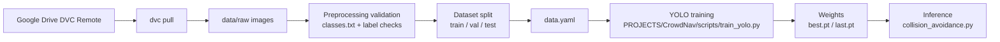
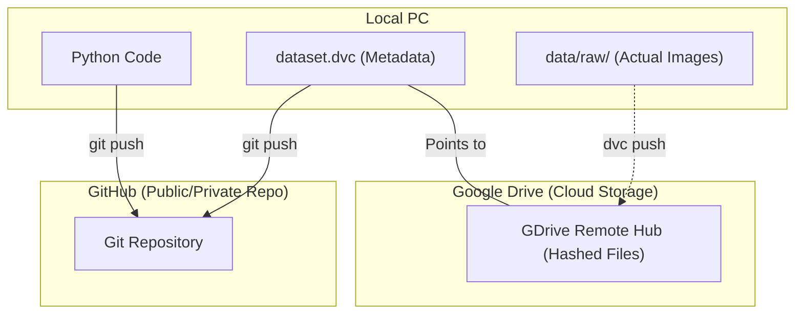
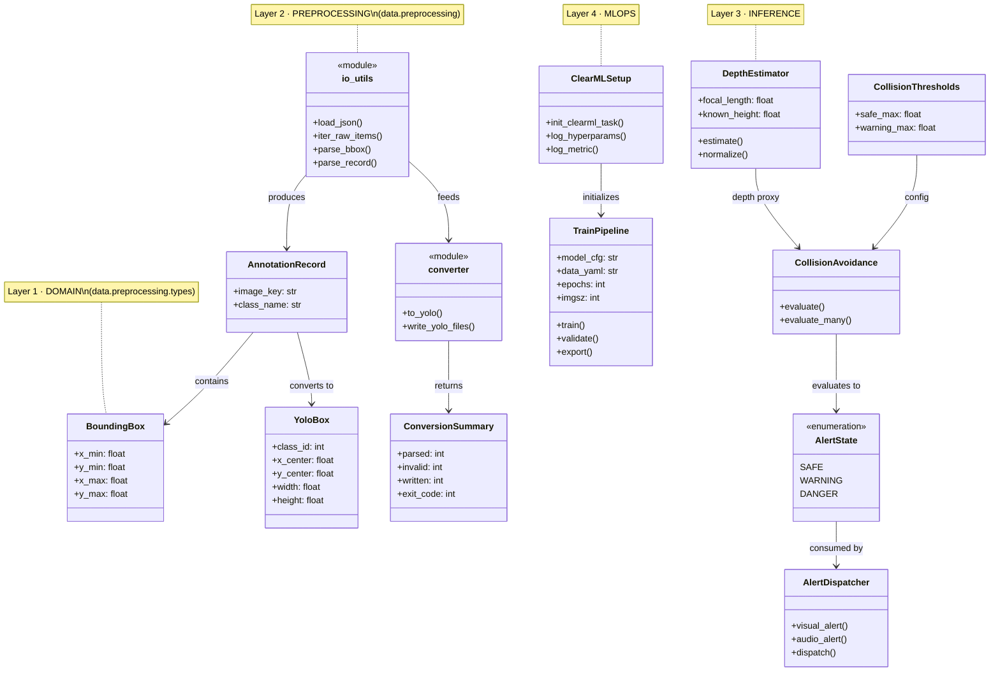
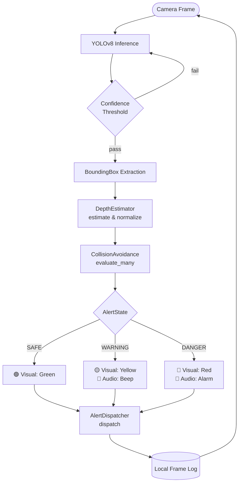
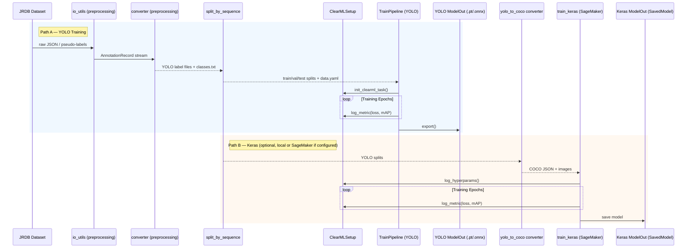

<p align="center">
  
  <h1 align="center">Crowd Detection and Accessibility Navigation</h1>
  <p align="center">
    <strong>Computer vision system for navigating crowded transport hubs.</strong>
    <br />
    <br />
    <a href="#project-abstract">Explore the docs</a>
    ·
    <a href="#faq">View FAQ</a>
    ·
    <a href="#contact">Contact</a>
  </p>
</p>

---


> A computer vision system that assists individuals with disabilities in navigating crowded transport hubs (airports, train stations, public spaces) using real-time obstacle detection and proximity logic.

## Environment Setup

The application code for training and inference lives under **`PROJECTS/CrowdNav`**. Create the virtual environment at the repo root or inside that folder; below uses the **repo root** and installs [`PROJECTS/CrowdNav/requirements.txt`](PROJECTS/CrowdNav/requirements.txt) (PyTorch + CUDA wheels + Ultralytics).

```bash
# 1. Clone the repository
git clone <repo-url> "Assignment 3"
cd "Assignment 3"

# 2. (Optional) Work in the CrowdNav package
cd PROJECTS/CrowdNav

# 3. Create and activate a virtual environment
python -m venv .venv
.venv\Scripts\activate   # Windows
# source .venv/bin/activate  # macOS/Linux

# 4. Install dependencies (use CrowdNav requirements for ML stack)
pip install -r requirements.txt
```

> **Default branch** is **`main`**; integration branch **`dev`** tracks ongoing work.

## ClearML (Experiment Tracking)

This project supports experiment tracking with **ClearML**.

### 1) One-time setup (per machine)

```bash
clearml-init
```

If you don't have a ClearML server, you can use the free ClearML hosting option during `clearml-init`, or set offline mode in your environment:

```bash
set CLEARML_OFFLINE_MODE=1
```

### 2) Smoke test (creates a Task and logs metrics)

Run from **`PROJECTS/CrowdNav`** (so `src` resolves on `PYTHONPATH`):

```bash
cd PROJECTS/CrowdNav
python -m src.clearml_smoketest
```

## Training (YOLO) — quick reference

Training is implemented with **Ultralytics YOLO** and `scripts/train_yolo.py` inside [`PROJECTS/CrowdNav`](PROJECTS/CrowdNav). Typical setup:

| Topic | Details |
|--------|--------|
| **Default model** | `yolov8m.pt` (override with `--model-cfg`) |
| **Data config** | `data/processed/splits/data.yaml` with `path: .` (portable across machines) |
| **Split ratio** | Train / val / test **8 : 1 : 1** (see `src/data/split_by_sequence.py`) |
| **Defaults** | 100 epochs, early-stop patience 20, batch 16, dataloader `workers` 4 (suits **ml.g4dn.xlarge**: T4, 16 GB system RAM) |
| **Device** | Omit `--device` to auto-select **CUDA** if available, else CPU; or `--device 0` / `CROWDNAV_DEVICE=cpu` |
| **Cloud** | **AWS SageMaker** Notebook/Studio on **ml.g4dn.xlarge** — run the same command on the instance; **no S3** required (data on EBS next to the repo) |
| **Local** | Same commands on a machine with **NVIDIA CUDA** installed |

**One-shot train** (from `PROJECTS/CrowdNav`):

```bash
python scripts/train_yolo.py \
  --data-yaml data/processed/splits/data.yaml \
  --model-cfg yolov8m.pt \
  --epochs 100 --batch 16 --workers 4
```

Full pipeline diagram and pseudo-labeling thresholds are documented in [`PROJECTS/CrowdNav/PROJECTS/docs/data_pipeline_diagram.md`](PROJECTS/CrowdNav/PROJECTS/docs/data_pipeline_diagram.md). Orchestration notes: [`notebooks/01_sagemaker_clearml_launcher.ipynb`](PROJECTS/CrowdNav/notebooks/01_sagemaker_clearml_launcher.ipynb).

## Data Version Control (DVC)

This project uses **DVC** with **Google Drive** as the remote storage for large datasets and model weights.

### Current Data Flow



### DVC Workflow Overview



<details>
<summary><strong>DVC vs Git (expand)</strong></summary>

### Roles
- **Git (GitHub):** Source code, docs, and small **pointers** (`*.dvc`) that record where a dataset version lives in remote storage.
- **DVC (e.g. Google Drive):** Stores large blobs—images, labels, checkpoints—not suitable for Git.

### Drive layout
In the web UI you may see hash folders (`4f/`, `a2/`) instead of `images/`, `labels/`. **Do not move or edit those files in the browser.** DVC owns the cache layout. Use only `dvc push` and `dvc pull` to transfer data.

### Example: add POV images
1. Add files under `data/raw/`.
2. `dvc add data/raw` — updates the pointer and stages remote upload.
3. `dvc push` — uploads bulk data to the remote.
4. `git add` the `.dvc` files, commit, `git push`.
5. Teammates: `git pull` then `dvc pull` to materialize the same data locally.

</details>

### Pulling Data (Most Common)
```bash
# Download datasets & models from Google Drive
dvc pull
```
> **Note:** On the first run, a browser window will open for Google authentication. Log in with the Google account that has access to the shared Drive folder.

### Pushing Data (After Adding/Updating Datasets)
```bash
# 1. Track new or updated data with DVC (paths may live under PROJECTS/CrowdNav — adjust to your layout)
dvc add data/raw
dvc add data/processed
dvc add models/

# 2. Commit the metadata files to Git
git add data/raw.dvc data/processed.dvc models.dvc .gitignore
git commit -m "Update dataset v2"

# 3. Upload the actual data to Google Drive
dvc push

# 4. Push Git changes
git push origin main
```

### For New Team Members
1. Ask the project owner to share the Google Drive folder with your Google account (Editor access).
2. Clone the repo, install dependencies, then run `dvc pull`.
3. Authenticate via the browser popup — data will be downloaded automatically.

<details>
<summary><strong>Table of Contents</strong></summary>

- [Team Members](#team-members)
- [Project Abstract](#project-abstract)
- [Additional Support Required](#additional-support-required)
- [Repository Layout](#repository-layout)
- [Submission Summary](#submission-summary)
- [File Naming Convention](#file-naming-convention)
- [Key Rules](#key-rules)
- [FAQ](#faq)
- [Contact](#contact)
</details>

---

## Team Members

| Name | Student ID | Role (Equally Distributed DL Workload) |
|------|------------|-----------------------------------------|
| TBD  | TBD        | **Data Engineering & Preprocessing:** Dataset curation (JRDB), POV filtering, and augmentation strategies for wheelchair perspective. |
| Jungwook Van | 25167747 | **YOLO Transfer Learning (Team Lead):** Fine-tuning YOLO v8/v10 for target classes, model optimization, and latency benchmarking. |
| TBD  | TBD        | **Inference Logic & Thresholding:** Developing bounding-box scaling heuristics for proximity estimation and building the alerting pipeline. |

> **Note:** The specific role assignments above are tentative and will be finalized after further team discussion.

---

## Project Abstract

Navigating densely populated transport hubs presents significant barriers to safe and independent travel for individuals with mobility disabilities. In dynamic environments, unpredictable pedestrian movements and transient physical obstacles often compromise user safety. To address these challenges, this project introduces a computer vision-based navigational assistance system driven by a single-stage Crowd Detection Convolutional Neural Network (YOLO). Designed specifically for a lower-vantage, first-person perspective, such as that of a wheelchair user, the system processes real-time video inputs to proactively identify pedestrians and crowded areas. Using transfer learning on the JRDB dataset, the model is fine-tuned to recognize pedestrian dynamics within crowded transport environments. Rather than relying on heavy multi-model architectures for density mapping, our system employs an efficient bounding-box scaling and heuristic depth-thresholding approach to estimate the proximity of approaching hazards. By analyzing pedestrian scale and position within the frame, the system triggers real-time visual or auditory warnings, effectively acting as a localized collision-avoidance assistant. This streamlined, single-model CNN approach aims to significantly mitigate navigation difficulties in high-traffic areas, increasing independence and safety without requiring constant cloud connectivity or heavy edge-computing resources.

### Approach
*   **Single-Stage Detection:** **YOLOv8** (default fine-tune: `yolov8m`) via transfer learning for high-speed person detection in crowds.
*   **Wheelchair POV Optimization:** Tailored model calibration for low-angle perspectives to ensure reliable detection of proximity obstacles.
*   **Bounding-Box Scaling Heuristic:** Estimating proximity based on the relative size of detected bounding boxes within the frame.
*   **Depth Thresholding:** Implementing a simple linear heuristic where proximity alerts are triggered once a pedestrian's bounding box area exceeds a predefined threshold.
*   **Output:** Actionable alerts (Visual/Audio) via a simplified inference pipeline.

### Dataset Details
*   **Crowd Detection & Tracking:** **[JRDB Dataset](https://jrdb.erc.monash.edu/)**, a large-scale dataset of indoor and outdoor social navigation collected from a social mobile robot, providing wheelchair-height 360-degree cylindrical panoramic video and 3D point clouds for pedestrian detection.
*   **Validation & Context:** **JRDB POV Context**, applying the dataset's lower-vantage perspective to validate proximity heuristics in realistic, crowded hub environments.

## Additional Support Required

To successfully achieve the project outcomes, the team anticipates requiring the following support:

*   **Computational Resources:** Access to UTS high-performance computing (HPC) clusters or cloud GPU resources to facilitate the training of computationally intensive deep learning models (such as YOLO) within the project timeframe.
*   **Ethics Clearance Guidance:** Advice on UTS ethics approval procedures if the team determines that capturing supplemental custom video footage within university spaces is necessary for localized validation testing.

---

## Repository Layout

```text
.
├── README.md                 # This file — assignment + CrowdNav overview
├── requirements.txt         # (optional) root; primary ML stack: PROJECTS/CrowdNav/requirements.txt
├── .github/                  # CI (e.g. build-check for CrowdNav)
└── PROJECTS/
    ├── PRD.md
    ├── TechSpec.md
    └── CrowdNav/             # Main code: data pipeline, YOLO training, inference, deploy/
        ├── scripts/          # train_yolo.py, self_train_loop.py, automate_preprocessing.py
        ├── src/              # data/, inference/, mlops/ (TrainPipeline, training_device)
        ├── deploy/          # Dockerfile (PyTorch + CUDA 12.1), docker-compose
        ├── notebooks/       # SageMaker / local training notes
        ├── data/            # raw + processed (often gitignored / DVC)
        └── PROJECTS/        # SysML + docs (e.g. data_pipeline_diagram.md)
```

---

## Submission Summary

| Part   | Description                | Submitted By                 | Status |
|--------|----------------------------|------------------------------|--------|
| **Part-A** | Project Proposal           | **Every student individually** | Pending |
| **Part-B** | Intermediate Deliverable 1 | One per team                 | TBD |
| **Part-C** | Intermediate Deliverable 2 | One per team                 | TBD |
| **Part-D** | Intermediate Deliverable 3 | One per team                 | TBD |
| **Part-E** | Final Project Report       | **Every student individually** | TBD |
| **Part-G** | Oral Defense               | **Every student individually** | TBD |

### File Naming Convention

```bash
Assignment-3-<Part>-<StudentName>-<StudentID>.<doc/pdf>
```

**Example:** `Assignment-3-PartA-NabinSharma-12345678.pdf`

---

## Key Rules

- **Group size:** Exactly **3 students** (min and max).
- **Session Flexibility:** Groups can include students from different tutorial/lab sessions.
- **Model Training:** Network **training is required** — pre-trained model alone is not accepted (transfer learning is permitted).
- **Oral Defense (Part-G):** **Mandatory** for every student — project is **INCOMPLETE** without it.
- **Deadlines:** Intermediate deadlines (Part-B, C, D) have no late penalties, but all work must be submitted before the **final deadline**.
- **Individual Contribution:** The Part-E individual contribution section must be unique per student.

---

## FAQ

<details>
<summary><strong>Are intermediate deadlines (Part-B, C, D) strict?</strong></summary>
<br>
No late penalties for intermediate parts, but <b>everything must be submitted before the final project deadline</b>. Reference deadlines are on the Week-1 Introduction slides (slide-7).
</details>

<details>
<summary><strong>Can I use YOLO or other frameworks?</strong></summary>
<br>
Yes. Any crowd detection or computer vision framework is allowed. <b>Training of the network is required</b> — transfer learning is permitted, but you must train the network yourself.
</details>

<details>
<summary><strong>What if I can't find a team?</strong></summary>
<br>
Still submit Part-A individually. The teaching team will assist in forming groups after Part-A submissions.
</details>

<details>
<summary><strong>Does Part-E require separate reports per student?</strong></summary>
<br>
Yes. All members submit individually. Content and results can match, but the <b>Individual Contribution (Appendix A)</b> section must reflect each student's personal contribution.
</details>

<details>
<summary><strong>What is assessed in the Oral Defense (Part-G)?</strong></summary>
<br>
Content from <b>Week-1 to Week-11</b> plus your project. The oral defense is mandatory — the project is incomplete without it.
</details>

---

## Contact

For specific questions regarding the assignment specifications, contact the **subject coordinator via email** as soon as possible.

<br />

<p align="center">
  <a href="https://github.com/Abblix/Oidc.Server"></a>
  <br />
  <strong>UTS Deep Learning (42028) • Semester 1, 2026</strong>
</p>

---

## Architecture

The CrowdNav codebase follows a 4-layer architecture aligned to the class, flow, and sequence diagrams used for implementation planning.

### Diagram 1: Class Structure (4 Layers)



### Diagram 2: Real-Time Inference Flow (Edge Runtime)



### Diagram 3: Training Pipeline Sequence (YOLO + Keras)


