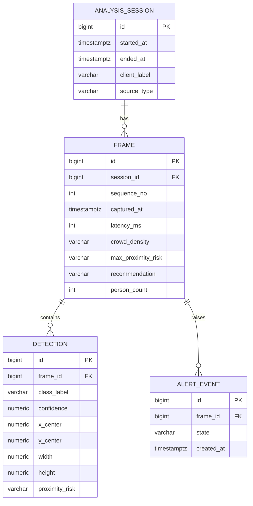

# Backend Data Model & ERD (PostgreSQL + Spring Data JPA)

## 1. Motivation

The Spring backend forwards frames to inference and returns results. With v1.1 it supports **opt-in
persistence**: when `session_id` is supplied on `analyze-frame`, frame metadata is stored asynchronously.
Without `session_id`, the path remains fully stateless. This plan introduced **PostgreSQL + Spring Data JPA** so the system can:

- keep a **history** of analysis sessions and their detections (FR-11),
- expose **session-history APIs** (FR-12, [`API_SPEC.md`](API_SPEC.md) §5),
- supply real numbers for the **latency/FPS metrics** currently "TBD" in `docs/reports/evaluation_metrics.md`.

**Privacy (NFR-9):** store only *derived metadata* — normalized bounding boxes, class labels, and risk
states. **Raw frames are never persisted** to the DB or disk.

## 2. Entity-Relationship Diagram



**Cardinality:** one session has many frames; one frame has many detections and many alert events.
`ALERT_EVENT` is optional (a denormalized convenience for "when did risk escalate"); it can be derived
from `FRAME.max_proximity_risk` transitions and may be deferred to a later iteration.

## 3. Schema Detail

### `analysis_session`
| Column | Type | Null | Index | Notes |
|--------|------|------|-------|-------|
| id | BIGSERIAL PK | no | PK | |
| started_at | TIMESTAMPTZ | no | | Set on `POST /sessions`. |
| ended_at | TIMESTAMPTZ | yes | | Null while active. |
| client_label | VARCHAR(120) | yes | | e.g. "demo-laptop". |
| source_type | VARCHAR(16) | no | | enum: `WEBCAM \| UPLOAD \| MOCK`. |

### `frame`
| Column | Type | Null | Index | Notes |
|--------|------|------|-------|-------|
| id | BIGSERIAL PK | no | PK | |
| session_id | BIGINT FK→analysis_session.id | no | idx | `ON DELETE CASCADE`. |
| sequence_no | INT | no | | Monotonic per session (0,1,2…). |
| captured_at | TIMESTAMPTZ | no | idx | For time-range queries. |
| latency_ms | INT | yes | | End-to-end inference latency (NFR-1 data). |
| crowd_density | VARCHAR(8) | no | | enum: `LOW \| MEDIUM \| HIGH`. |
| max_proximity_risk | VARCHAR(8) | no | | enum: `SAFE \| WARNING \| DANGER`. |
| recommendation | VARCHAR(8) | no | | enum: `PROCEED \| CAUTION \| STOP`. |
| person_count | INT | no | | Denormalized `persons.length` for fast listing. |

Composite index: `(session_id, sequence_no)` unique.

### `detection`
| Column | Type | Null | Index | Notes |
|--------|------|------|-------|-------|
| id | BIGSERIAL PK | no | PK | |
| frame_id | BIGINT FK→frame.id | no | idx | `ON DELETE CASCADE`. |
| class_label | VARCHAR(16) | no | idx | enum: `person \| wheelchair \| luggage` (3-class — [`DETECTION_3CLASS_PLAN.md`](DETECTION_3CLASS_PLAN.md)). |
| confidence | NUMERIC(5,4) | no | | 0.0000–1.0000. |
| x_center,y_center,width,height | NUMERIC(6,4) | no | | Normalized 0–1 (matches `BBox` DTO). |
| proximity_risk | VARCHAR(8) | yes | | `SAFE\|WARNING\|DANGER`; null for non-risk classes if applicable. |

### `alert_event` (optional)
| Column | Type | Null | Index | Notes |
|--------|------|------|-------|-------|
| id | BIGSERIAL PK | no | PK | |
| frame_id | BIGINT FK→frame.id | no | idx | `ON DELETE CASCADE`. |
| state | VARCHAR(8) | no | | `SAFE\|WARNING\|DANGER`. |
| created_at | TIMESTAMPTZ | no | | |

**Enums:** stored as `VARCHAR` + DB `CHECK` constraint (portable, human-readable) — not native PG enums,
to avoid migration friction. **Retention:** optional scheduled purge of sessions older than N days.

## 4. JPA Mapping Plan

Package `com.crowdnav.api.persistence` (entities), `…repository` (Spring Data repos). Entities mirror the
existing DTOs (`PersonDetection`, `BBox`) but are separate persistence types — keep DTOs as the API shape.

| Entity | Maps to | Repository |
|--------|---------|------------|
| `AnalysisSession` | `analysis_session` | `AnalysisSessionRepository extends JpaRepository<…,Long>` |
| `Frame` | `frame` (`@ManyToOne AnalysisSession`) | `FrameRepository` (`findBySessionIdOrderBySequenceNo`) |
| `Detection` | `detection` (`@ManyToOne Frame`) | `DetectionRepository` (`findByFrame_Session_Id`, filter by class/risk) |
| `AlertEvent` | `alert_event` (`@ManyToOne Frame`) | `AlertEventRepository` |

Embeddable `BBoxEmbeddable` (x_center,y_center,width,height) maps to the four `detection` columns.

### 4.1 build.gradle additions
```gradle
implementation 'org.springframework.boot:spring-boot-starter-data-jpa'
implementation 'org.flywaydb:flyway-core'
implementation 'org.flywaydb:flyway-database-postgresql'
runtimeOnly   'org.postgresql:postgresql'
testImplementation 'com.h2database:h2'   // fast unit tests; PG via Testcontainers for integration
```

### 4.2 application.yml additions
```yaml
spring:
  datasource:
    url: ${DB_URL:jdbc:postgresql://localhost:5432/crowdnav}
    username: ${DB_USER:crowdnav}
    password: ${DB_PASSWORD:crowdnav}
  jpa:
    hibernate:
      ddl-auto: validate     # schema owned by Flyway, not Hibernate
    open-in-view: false
  flyway:
    enabled: true            # migrations in src/main/resources/db/migration/V1__init.sql
```
> Use **Flyway** for the schema (`ddl-auto: validate`) so migrations are reviewable and reproducible —
> not `ddl-auto: update`. Secrets via env vars only (NFR-6).

### 4.3 docker-compose.yml addition (planned)
```yaml
  db:
    image: postgres:16
    environment:
      POSTGRES_DB: crowdnav
      POSTGRES_USER: crowdnav
      POSTGRES_PASSWORD: crowdnav
    ports: ["5432:5432"]
    volumes: ["dbdata:/var/lib/postgresql/data"]
# backend: add `depends_on: [inference, db]` and DB_* env vars.
# volumes: { dbdata: {} }
```

## 5. Write Path

Persistence hooks into `AnalyzeFrameService.analyzeFrame()` **after** inference returns and **before/while**
the response is sent to the client:

1. Resolve the `session_id` from the request. **If absent, skip persistence entirely** (stateless path).
2. If present, verify the session exists (404 if not) **before** inference.
3. Run inference; measure `latency_ms` on the inference delegate path.
4. Return `AnalyzeFrameResponse` to the client immediately.
5. **@Async:** build a `Frame` from the response + `Detection` rows from `persons[]`; save via `FramePersistenceService`.

**Design:** `PersistingAnalyzeFrameService` wraps the mock/remote `AnalyzeFrameService` bean so the DB write is
**non-blocking** and adds **zero latency** to the FR-6/NFR-1 response path (**NFR-8**). Toggle via
`app.persistence.enabled` (default `true`; set `false` for inference-only local dev without PostgreSQL).

## 6. API Tie-In

| Endpoint (planned) | Backed by |
|--------------------|-----------|
| `POST /api/v1/sessions` | `AnalysisSessionRepository.save` |
| `GET /api/v1/sessions` | `findAll(Pageable)` |
| `GET /api/v1/sessions/{id}` | session + aggregate (`count`, `avg(latency_ms)`, worst risk) |
| `GET /api/v1/sessions/{id}/detections` | `DetectionRepository` filtered by class/risk |
| `PATCH /api/v1/sessions/{id}` | `AnalysisSession.setEndedAt` |

Schemas defined in [`API_SPEC.md`](API_SPEC.md) §5.

## 7. Implementation Checklist

- [x] Add JPA/Flyway/Postgres deps (§4.1); add datasource + flyway config (§4.2).
- [x] `V1__init.sql` Flyway migration creating the 3 tables (+ FKs, indexes, CHECKs); `alert_event` deferred.
- [x] Entities + embeddable + repositories in `com.crowdnav.api.persistence`.
- [x] `PersistingAnalyzeFrameService` + `FramePersistenceService` (async, non-blocking) — NFR-8.
- [x] `SessionController` for §6 endpoints.
- [x] `db` service in `application/docker-compose.yml`; backend `depends_on` + `DB_*` env (§4.3).
- [x] Tests: H2 + Flyway in test profile; `SessionControllerTest`, `AnalyzeFramePersistenceTest`.
- [x] `PATCH /api/v1/sessions/{id}` — set `ended_at` (session close).
- [x] `InferenceHealthIndicator` — inference `/health` wired to Spring readiness (ADR-0002 #4).
- [ ] Extend `detection.class_label` enum when 3-class lands (schema CHECK already allows 3 classes; inference pending).
