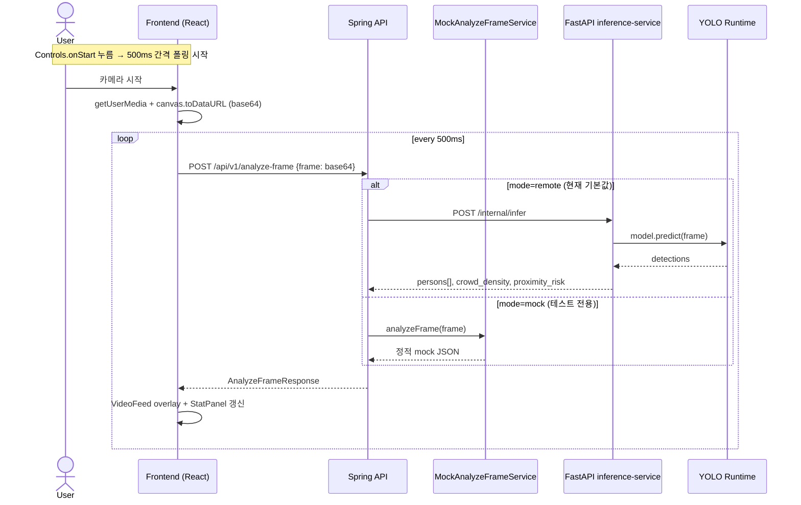

# CrowdNav 디자인 결정 문서 (DESIGN.md)

> ⚠️ **이 파일은 placeholder 임.** 각 섹션 안의 `<TBD: ...>` 와 `<DECIDE: ...>` 부분을
> 사용자가 채워야 함. 자동 생성된 텍스트는 출발점 일 뿐, 실제 디자인 결정은
> 사람이 내려야 한다는 점 명시.
>
> 작업 가이드는 [`docs/skills/crowdnav-design/SKILL.md`](skills/crowdnav-design/SKILL.md) 참조.

---

## 0. 한 줄 요약

CrowdNav 프로젝트 (UTS 42028 DL A3) 의 **현재 구조 / 레거시 / 미해결 디자인 이슈** 를
한 곳에 모아두는 살아있는 문서. ADR 결정이 확정될 때마다 해당 ADR 로 링크 옮기고
이 문서엔 결정 요약만 남김.

---

## 1. 시스템 컨텍스트

### 1.1 무엇을 만드는가
<TBD: PRD 기반 한 문단 요약 — 누가 / 어떤 환경에서 / 무엇을 / 어떤 메트릭으로 성공 판단>

기존 `docs/PRD.md` 와 `docs/TechSpec.md` 에서 발췌해 채울 것.

### 1.2 외부 의존성
- **데이터셋**: JRDB → YOLO 변환 (`train/src/data/jrdb_to_yolo.py`)
- **모델**: Ultralytics YOLOv8 (`yolov8n.pt` / `yolov8m.pt`)
- **실험 추적**: ClearML (`train/src/utils/clearml_setup.py`)
- **배포 후보**: <DECIDE: Docker 단독 vs SageMaker — 1.x ADR 작성 필요>
- **API 런타임**: Spring Boot (`application/backend/crowdnav-api/`)
- **클라이언트**: React + Vite (`application/frontend/`)
- **추론 서비스**: Python FastAPI? 미확정 (`application/inference-service/main.py`)

---

## 2. 현재 아키텍처 스냅샷 (as-of 2026-05-05)

### 2.1 4-layer 스캐폴드 (System_Architecture_Documentation.md 참조)
```
Domain → Preprocessing → Inference → MLOps
```

자세한 BDD 다이어그램은 [`docs/architecture/System_Architecture_Documentation.md`](architecture/System_Architecture_Documentation.md) 의 Mermaid `classDiagram` 사용.

### 2.2 컴포넌트 — 한 눈에 (2026-05-05 병렬 분석 결과 반영)

| Layer | 모듈 / 패스 | 진입점 | 외부 의존성 | 비고 |
|---|---|---|---|---|
| Train | `train/src/training/train_pipeline.py` | `scripts/train_yolo.py` | ultralytics, clearml | `sys.path` 핵 잔존 |
| Train | `train/src/data/` (preprocessing, pseudo_label, split) | `scripts/automate_preprocessing.py`, `jrdb_train_to_yolo.py`, `run_auto_labeling.py` | ultralytics, opencv, torch | `prepare/pseudo_label.py` 가 `pseudo_label_yolov8.main()` 위임 (중복) |
| Train | `train/src/inference/` (alert_dispatcher, collision_avoidance, depth_estimator) | (라이브러리만) | numpy | **API 바인딩 없음** — train 내부에서만 사용 |
| Train | `train/scripts/self_train_loop.py` | CLI | ultralytics | 멀티 사이클 self-training |
| Backend | `application/backend/crowdnav-api/` (Spring Boot 3.5.6) | `@SpringBootApplication`, Gradle | spring-boot-starter-web/validation | 엔드포인트 1개: `POST /api/v1/analyze-frame` |
| Backend | `RemoteAnalyzeFrameService` | (Spring 빈) | RestClient (HTTP/1.1) | **구현 완료** — FastAPI inference 호출, `remote` 기본 모드 |
| Frontend | `application/frontend/src/App.tsx` | Vite 6 | React 19.2.5, axios 1.16, styled-components 6.4 | 컴포넌트 3개 (VideoFeed, Controls, StatPanel), 모두 stateless |
| Inference svc | `application/inference-service/main.py` | FastAPI 0.115 | uvicorn + ultralytics | **구현 완료** — `/internal/infer` 가 YOLOv8 person detection + proximity heuristics 수행 |
| Infra | `infra/docker/` | `docker-compose.yml` (Jupyter Lab) | pytorch:2.5.1-cuda12.1 | **학습 미수행** — dev 환경 전용 |
| Infra | `infra/sagemaker/sagemaker_launch.py` → `sagemaker_train.py` | boto3 + SageMaker SDK | ultralytics | 실제 학습 경로. ml.g5.xlarge 디폴트 |
| Infra | `infra/train_skeleton.py`, `train_keras_skeleton.py` | (orphan?) | tensorflow/keras | **레거시 후보** — YOLO 라인과 무관 |
| Legacy | `PROJECTS/CrowdNav/` | (잔존) | — | [LEGACY_CATALOG.md](architecture/LEGACY_CATALOG.md) 참조 |

### 2.3 호출 흐름 (sequence) — 현재 mock 모드 기준

> ⚠️ 현재 `app.inference.mode=mock` 으로 동작. inference-service 는 **호출되지 않음**. 아래는 *intended* 흐름이고, 실제 구현은 §4.1 ADR 결정 후 완성됨.



---

## 3. 레거시 카탈로그

### 3.1 카탈로그 위치

병렬 분석으로 식별된 잔존물 전체 목록은
[`docs/architecture/LEGACY_CATALOG.md`](architecture/LEGACY_CATALOG.md) 에 분리.
요약만 여기에 남김:

- 모델 가중치 4종 (~193MB) — provenance 불명
- `auto_labels_08/` 446K 라벨 파일 — 중복 검증 필요
- `.env` 파일에 ClearML 5개 키 평문 노출 ⚠️
- `infra/train_skeleton.py`, `train_keras_skeleton.py` — Keras orphan
- `train/scripts/*.py` 의 `sys.path.insert` 핵 4곳

### 3.2 처리 정책 (3택, 결정 필요)

<DECIDE: 항목별로 다를 수 있음 — LEGACY_CATALOG.md §5 우선순위 참고>
- (A) **Freeze & Move** — `archive/PROJECTS_CrowdNav_2026Q1/` 로 이동
- (B) **Hard Delete** — working tree 에서 제거
- (C) **Keep as-is** — gitignored 로 로컬에만

→ 항목별 ADR: `ADR-0006`(weights), `ADR-0007`(dataset), `ADR-0008`(secrets), `ADR-0009`(keras), `ADR-0010`(import paths)

### 3.3 잔존 import / hardcoded path 검사

- `train/src/repo_paths.py` 가 path resolver — OK
- `train/scripts/{train_yolo,self_train_loop,automate_preprocessing,run_auto_labeling}.py` 모두 `sys.path.insert(0, str(PROJECT_ROOT))` 사용 — 패키지 install 경로 정리 후 제거 가능
- `train/src/data/prepare/pseudo_label.py` 가 `pseudo_label_yolov8.main()` 그대로 위임 — backward-compat 목적, 정리 후보

---

## 4. 미해결 디자인 결정 (Open Questions)

각 항목은 ADR 로 뽑아낼 후보. 결정 시 ADR 파일로 옮기고 여기엔 `→ ADR-NNNN` 링크만 남김.

### 4.1 Inference 런타임 형태
<DECIDE>: `application/inference-service/main.py` 가 (a) FastAPI 서버 (b) AWS Lambda 핸들러 (c) Spring Boot 안의 sidecar 중 무엇이 될지.
- 영향: latency 목표, 배포 토폴로지, GPU 요구
- 후보 ADR: `ADR-0002-inference-runtime-shape.md`

### 4.2 배포 경로 — Docker vs SageMaker
<DECIDE>: 둘 다 살아있을지, 하나로 단일화할지.
- 영향: CI 매트릭스, 비용, 학생 데모 가능성
- 후보 ADR: `ADR-0003-deployment-path.md`

### 4.3 ClearML — required vs optional
현재 `CLEARML_OFFLINE_MODE=1` 으로도 돌게 되어있음. 보고 평가용 실행은 어느 모드로?
- 후보 ADR: `ADR-0004-experiment-tracking-policy.md`

### 4.4 Frontend ↔ Backend API 계약
<DECIDE>: OpenAPI 스펙 단일 소스 (Spring → openapi.yaml 자동생성?), TS 타입 동기화 전략
- 후보 ADR: `ADR-0005-api-contract-source.md`

### 4.5 Self-training 루프 안정성
`train/scripts/self_train_loop.py` — 어떤 트리거 / 어떤 정지 조건?
이미 `docs/runbooks/self_training_runbook.md` + `self_training_policy.md` 존재.
- <TBD: 정책과 코드의 정합성 검사 결과>

### 4.6 Docker stack 의 역할 (W4 발견)
현재 `infra/docker/Dockerfile` 의 entry 가 **Jupyter Lab** — 학습 안 함, dev 환경 전용.
- 의도된 동작인가? 아니면 `sagemaker_train.py` 를 docker 안에서도 돌릴 의도였나?
- 후보 ADR: `ADR-0011-docker-role-clarification.md`

### 4.7 yolov8n.pt 중복
repo root 에 `yolov8n.pt` (6.5MB) 가 있고, `PROJECTS/CrowdNav/yolov8n.pt` (6.3MB) 도 존재. 중복일 가능성 큼.
- 후보 ADR: `ADR-0006` 에 합쳐서 처리

---

## 5. 결정된 항목 (Decided)

확정된 ADR 들이 여기에 한 줄 요약 + 링크로 누적됨.

| # | 결정 | 날짜 | ADR |
|---|---|---|---|
| 0002 | Backend = Spring Boot 단일. inference-service 는 Spring 의 내부 추론 어댑터로 Docker 안에 번들 | 2026-05-05 | [ADR-0002](decisions/ADR-0002-backend-runtime-spring.md) |
| 0003 | Docker = FE+BE+inference webapp 패키징, SageMaker = YOLO 학습 전용. `best.pt` 만 핸드오프 | 2026-05-05 | [ADR-0003](decisions/ADR-0003-deployment-split-docker-sagemaker.md) |
| 0008 | ClearML 키 평문 disk 보관 금지. `~/.clearml.conf` + CI secret 만 사용. `.env.example` 만 repo 에 | 2026-05-05 | [ADR-0008](decisions/ADR-0008-clearml-secret-hygiene.md) |
| 0009 | Keras skeleton 4파일 (`infra/train_skeleton.py`, `infra/train_keras_skeleton.py`, `train/src/data/keras/*`) 완전 삭제 | 2026-05-05 | [ADR-0009](decisions/ADR-0009-keras-skeleton-removal.md) |
| 0010 | `train/` 을 `crowdnav-train` editable package 로 전환. 5개 sys.path 핵 제거, `from crowdnav_train.X` 일괄 import | 2026-05-05 | [ADR-0010](decisions/ADR-0010-train-packaging-remove-syspath-hacks.md) |

### 5.1 Deferred (다음 라운드)
- **0007** auto_labels_08 라벨 출처 식별 — 사용자: "분명 하나는 직접 JRDB 가 제공한 것" → hash/내용 비교 워커 별도 dispatch 필요 → 초안 [ADR-0007](decisions/ADR-0007-auto-labels-provenance-hash-worker.md)
- **0004** ClearML required vs optional — 0008 이후 정책으로 분리
- **0005** Frontend↔Backend API 계약 단일 소스 (OpenAPI) — 0002 통합 작업 중에 자연스럽게 결정 → 초안 [ADR-0005](decisions/ADR-0005-api-contract-openapi-single-source.md)
- **0006** legacy weights (`yolo26n.pt` 등) 처리 — 0009 정리 후 함께 → 초안 [ADR-0006](decisions/ADR-0006-legacy-weights-handling.md)
- **0011** Docker 의 역할 — **0003 에 흡수됨** (해소)

---

## 6. 다이어그램 인덱스

| 종류 | 파일 | 상태 |
|---|---|---|
| Architecture (BDD) | `docs/architecture/System_Architecture_Documentation.md` | ✅ exists |
| Data pipeline | `docs/architecture/data_pipeline_diagram.md` | ✅ exists |
| Repo layout | `docs/architecture/REPO_LAYOUT_AND_FUTURE_DEVELOPMENT.md` | ✅ exists |
| Sequence (런타임 — webapp) | `docs/DESIGN.md` §2.3 | ✅ 1차 작성 (mock+intended) |
| Sequence (학습 파이프라인) | `docs/architecture/sequence_training_pipeline.md` | ✅ exists |
| Legacy catalog | `docs/architecture/LEGACY_CATALOG.md` | ✅ exists |
| State machine (alerts) | `docs/architecture/state_alerts.md` | ✅ exists |

---

## 7. 작업 진행 시 참고

이 문서를 채울 때는 [`docs/skills/crowdnav-design/SKILL.md`](skills/crowdnav-design/SKILL.md) 의
Workflow Step A → B → C 따를 것. 특히 5개 이상 모듈 분석 시 단일 LLM call 금지,
Orchestrator-Workers 패턴 강제.

---

## 8. 변경 이력

| 날짜 | 변경 | 작성자 |
|---|---|---|
| 2026-05-05 | placeholder 골격 생성 | Claude (Cowork mode) |
| 2026-05-05 | Step A 병렬 분석(W1~W5) 결과 §2.2/§2.3/§3 반영, §4.6/§4.7 추가, LEGACY_CATALOG.md 분리 | Claude (Cowork mode) |
| 2026-05-05 | ADR-0002/0003/0008/0009/0010 Accepted, §5 Decided 표 갱신 (브랜치 `docs/design-decisions`) | Claude + 사용자 결정 |
