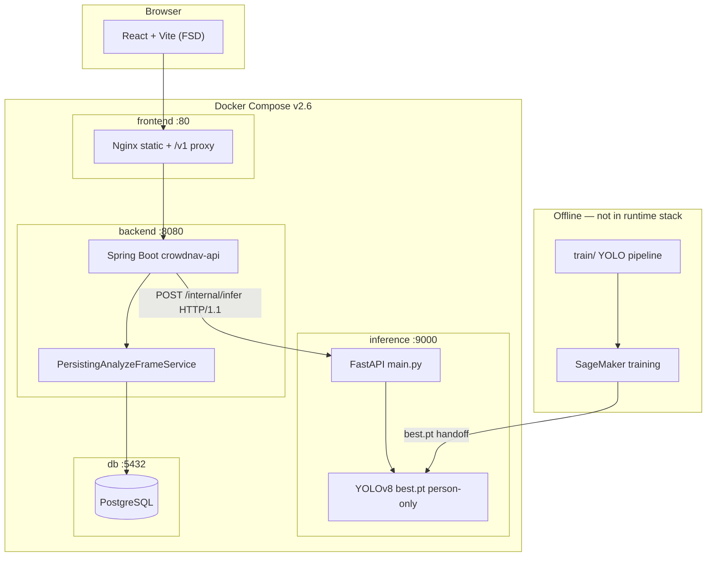
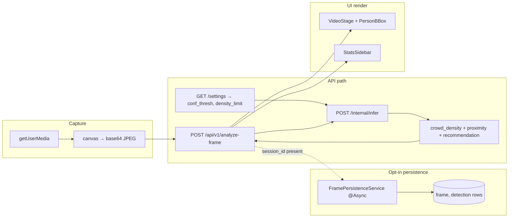
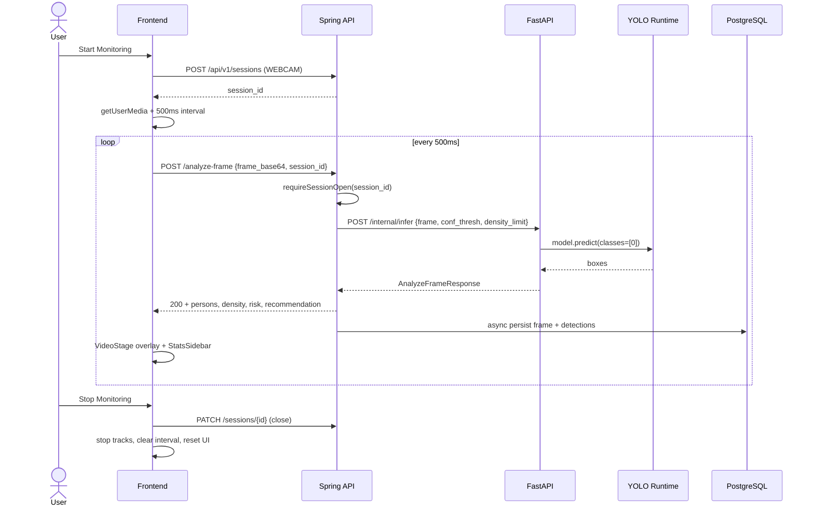
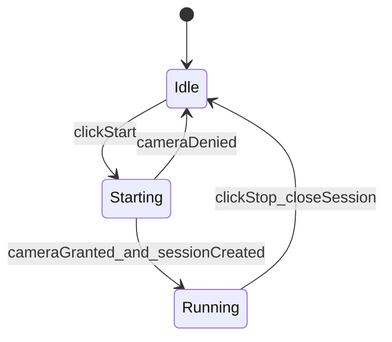
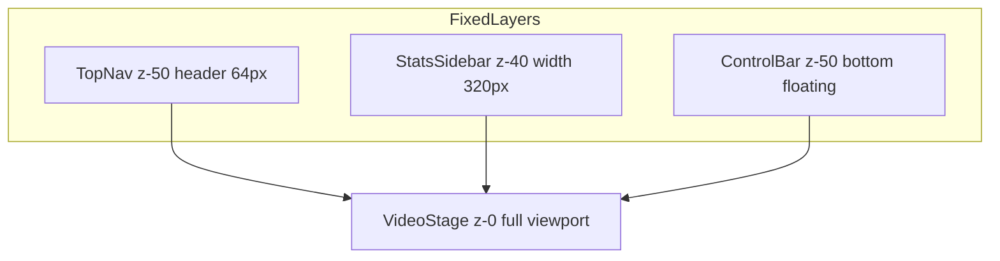

# CrowdNav Design Document (DESIGN.md)

> **Role:** Living design document for CrowdNav (UTS 42028 DL Assignment 3). Captures
> architecture, component responsibilities, runtime flows, and open design debt. Normative
> requirements live in [`REQUIREMENTS.md`](REQUIREMENTS.md); API contracts in [`API_SPEC.md`](API_SPEC.md).
> Immutable product prose in [`PRD.md`](PRD.md).

---

## Overview

### Design goal and scope

CrowdNav is a **3-tier computer-vision web application** that helps travellers with mobility
disabilities navigate crowded transport hubs. A React client captures live webcam frames at **2 FPS**
(500 ms interval), a Spring Boot API forwards them to a FastAPI/YOLO inference service, and the UI
renders colour-coded bounding boxes plus text guidance (`PROCEED` / `CAUTION` / `STOP`).

**In scope (shipped):** person detection (YOLOv8m on JRDB), crowd density (LOW/MEDIUM/HIGH),
proximity risk (SAFE/WARNING/DANGER), dashboard monitoring UX (FR-UI-1…12), session persistence
(FR-11/12/16), analytics/settings/live-map/archive extension pages (FR-14…17), 4-service Docker
deployment (FR-10).

**Out of scope (PRD §9 / REQUIREMENTS §4):** audio/haptic alerts, WCAG audit, turn-by-turn routing,
pause/resume monitoring, 3-class detection in the shipped `best.pt` (FR-13 is a research extension).

### Success criteria (design-relevant)

| Metric | Target | Design implication |
|--------|--------|-------------------|
| Latency (NFR-1) | < 500 ms / frame | Async persistence must not block response (NFR-8) |
| Throughput (NFR-2) | ≥ 2 FPS | Frontend interval fixed at 500 ms |
| mAP@0.5 person (NFR-3) | val > 0.40, test > 0.50 | Person-only `classes=[0]` in inference |
| Privacy (NFR-9) | No raw frames stored | DB stores bbox metadata only |

### Traceability

| Area | Primary requirements | User scenarios |
|------|---------------------|----------------|
| Dashboard / inference | FR-1…10, FR-UI-1…12, NFR-1…3, NFR-7, NFR-10 | S1 |
| Persistence / archive | FR-11, FR-12, FR-16, NFR-8, NFR-9 | S2 |
| Live map | FR-17 | S3 |
| Analytics | FR-14 | S4 |
| Settings | FR-15 | S5 |

---

## Architecture Design

### System architecture diagram



**Deployment split (ADR-0003):** Docker packages the demo stack; SageMaker is **training-only**.
Canonical compose: [`application/docker-compose.yml`](../application/docker-compose.yml).

### Data flow diagram



### Runtime modes

| `app.inference.mode` | When | Behaviour |
|---------------------|------|-----------|
| `remote` | **Default** — Docker, local dev, production demo | `RemoteAnalyzeFrameService` → FastAPI |
| `mock` | CI / `@SpringBootTest` only (`application.properties`) | `MockAnalyzeFrameService` — static JSON; inference not called |

> **Design decision:** Mock mode is retained for tests (workspace rule: do not remove
> `MockAnalyzeFrameService`). Production path is always `remote`.

### Component inventory (as-of 2026-06-19)

| Layer | Module | Entry / controllers | Responsibility |
|-------|--------|---------------------|----------------|
| **Frontend** | `application/frontend/` | Vite 6, React 19, FSD | 5 routes: `/`, `/analytics`, `/live-map`, `/archive`, `/settings` |
| **Backend** | `crowdnav-api` | `AnalyzeFrameController`, `SessionController`, `AnalyticsController`, `SettingsController` | Public API, persistence orchestration, settings |
| **Backend services** | | `RemoteAnalyzeFrameService`, `MockAnalyzeFrameService`, `PersistingAnalyzeFrameService`, `FramePersistenceService`, `SessionService`, `AnalyticsService`, `SettingsService` | Inference routing, async DB writes, aggregates |
| **Inference** | `inference-service/main.py` | `POST /internal/infer`, `GET /health` | YOLO predict, heuristics (`_crowd_density`, `_alert_state`, `_recommendation`) |
| **DB** | Flyway `V1__init.sql`, `V2__app_settings.sql` | PostgreSQL 16 | Sessions, frames, detections, `app_settings` |
| **Train** | `train/src/` | `scripts/train_yolo.py` | Offline JRDB → YOLO, collision_avoidance heuristics origin |
| **Infra** | `infra/docker/`, `infra/sagemaker/` | Thin wrapper + SageMaker launch | MODEL_DIR override; training jobs |

### Sequence — live monitoring (S1, remote mode)



---

## Component Design

### Frontend (Feature-Sliced Design)

| Layer | Key modules | Interfaces / contracts |
|-------|-------------|------------------------|
| `pages` | `DashboardPage`, `AnalyticsPage`, `LiveMapPage`, `ArchivePage`, `SettingsPage` | React Router routes |
| `widgets` | `DashboardShell`, `VideoStage`, `StatsSidebar`, `ControlBar`, `TopNav`, `SideNav`, `AppShell` | Presentation; layout tokens from `shared/config/theme/tokens.ts` |
| `features` | `useCrowdDetection`, `useRiskAlerts`, `session-recording`, `session-export`, `report-generation`, `analytics-data`, `live-map-markers`, `geolocation`, `sensor-settings`, `session-archive` | Call `shared/api/client.ts` → `/api/v1/*` |
| `entities` | `detection/PersonBBox` | Renders bbox + risk label (NFR-10) |
| `shared` | `api/client.ts`, `api/health.ts`, `customSourcesStorage.ts` | Axios; snake_case DTOs |

**Dependencies:** Browser APIs (`getUserMedia`, `MediaRecorder`, `navigator.geolocation`), MapLibre/OpenFreeMap on `/live-map`.

### Backend (Spring Boot)

| Component | Responsibilities | Key dependencies |
|-----------|------------------|------------------|
| `AnalyzeFrameController` | JSON + multipart frame upload; validation (FR-6, FR-8) | `AnalyzeFrameService` bean |
| `RemoteAnalyzeFrameService` | RestClient HTTP/1.1 to inference; forwards settings | `SettingsService`, inference base URL |
| `MockAnalyzeFrameService` | Static response for CI | — |
| `PersistingAnalyzeFrameService` | Decorator: infer then schedule async persist | `FramePersistenceService` |
| `FramePersistenceService` | Insert frame + detection rows; skip closed sessions | JPA repositories |
| `SessionService` | CRUD sessions; `requireSessionOpen` → 409 on closed | `AnalysisSessionRepository` |
| `AnalyticsService` | Aggregate frames for `/analytics/summary` | SQL aggregates |
| `SettingsService` | Single-row `app_settings`; validate PUT | `AppSettingsRepository` |

### Inference service (FastAPI)

| Function | Responsibility | Requirement |
|----------|----------------|-------------|
| `model.predict` | Person detection, `classes=[0]` | FR-1 |
| `_crowd_density` | n≤2 LOW, n≤5 MEDIUM, else HIGH; scaled by `density_limit` | FR-2, FR-15 |
| `_alert_state` | bbox height thresholds 0.25 / 0.45 | FR-3 |
| `_recommendation` | PROCEED / CAUTION / STOP from density + max risk | FR-5 |
| `/health` | 200 when `best.pt` loaded | FR-9 |

Logic origin: `train/src/inference/collision_avoidance.py`.

---

## Data Model

Core persistence schema is documented in [`BACKEND_ERD.md`](BACKEND_ERD.md). Summary:

```mermaid
erDiagram
    ANALYSIS_SESSION ||--o{ FRAME : has
    FRAME ||--o{ DETECTION : contains
    APP_SETTINGS ||--|| APP_SETTINGS : singleton

    ANALYSIS_SESSION {
        bigint id PK
        timestamptz started_at
        timestamptz ended_at
        varchar client_label
        varchar source_type
    }
    FRAME {
        bigint id PK
        bigint session_id FK
        int sequence_no
        varchar crowd_density
        varchar max_proximity_risk
        int person_count
    }
    DETECTION {
        bigint id PK
        bigint frame_id FK
        varchar class_label
        numeric confidence
        numeric x_center y_center width height
        varchar proximity_risk
    }
```

**API DTOs (runtime, not persisted as entities):**

```typescript
interface BBox {
  x_center: number; y_center: number; width: number; height: number;
}
interface Detection {
  class: 'person'; // wheelchair|luggage after FR-13
  confidence: number;
  bbox: BBox;
  proximity_risk: 'SAFE' | 'WARNING' | 'DANGER';
}
interface AnalyzeFrameResponse {
  persons: Detection[];
  crowd_density: 'LOW' | 'MEDIUM' | 'HIGH';
  max_proximity_risk: 'SAFE' | 'WARNING' | 'DANGER';
  recommendation: 'PROCEED' | 'CAUTION' | 'STOP';
}
```

**Privacy:** NFR-9 — no image bytes in DB; only derived metadata.

---

## Business Process

### Process 1 — Start / stop monitoring (FR-UI-1, FR-UI-2, FR-UI-6)



On **Start:** reset alerts → `POST /sessions` → `useCrowdDetection.start()` (500 ms loop with `session_id`).
On **Stop:** clear interval → `MediaStream` tracks stopped → `PATCH /sessions/{id}` → UI cleared.
Label is **Stop Monitoring** (not Pause) — pause/resume is Won't.

### Process 2 — Analyze frame with persistence (FR-11, NFR-8)

```mermaid
flowchart TD
  A[analyze-frame request] --> B{session_id?}
  B -->|no| C[infer only — stateless]
  B -->|yes| D{session open?}
  D -->|closed| E[409 Conflict]
  D -->|open| F[infer synchronously]
  F --> G[return 200 to client]
  F --> H[@Async persist frame + detections]
  C --> F
```

### Process 3 — Settings → inference (FR-15)

1. User updates confidence / density_limit on `/settings`.
2. `PUT /api/v1/settings` persists to `app_settings`.
3. Next `analyze-frame` → backend reads settings → forwards `conf_thresh`, `density_limit` to `/internal/infer`.
4. `density_limit` scales crowd-density bands (64 ≈ PRD §8 thresholds).

### Process 4 — Extension pages

| Route | Data flow | Notes |
|-------|-----------|-------|
| `/analytics` | `GET /analytics/summary?days=N` | Hotspot widget is **decorative session ranking**, not geo map (G-7, G-8) |
| `/live-map` | Browser GPS + 24 h session poll → zone markers | Fixed UTS anchor coordinates for demo zones |
| `/archive` | `GET /sessions` (filtered, paginated) → detail frames/detections | Export JSON client-side (FR-16) |
| `/settings` | `GET/PUT /settings` + `localStorage` custom sources (FR-UI-11) | `audible_alerts` field unused (PRD §9) |

---

## Error Handling Strategy

| Layer | Failure | Response / recovery |
|-------|---------|---------------------|
| Frontend | Camera denied | `reportError`; remain Idle; no loop |
| Frontend | Analyze API error | Log; **keep loop running** (no crash) |
| Frontend | Unmount | `useCrowdDetection` cleanup stops tracks |
| Backend | Blank/invalid base64 | 400 |
| Backend | Oversize frame (> 5 MB) | 413 |
| Backend | Unknown `session_id` | 404 |
| Backend | Closed session on analyze | 409 |
| Backend | Inference 5xx | 502 |
| Inference | Model not loaded | 503 |
| Inference | Undecodable image | 400 |

Full matrix: [`API_SPEC.md`](API_SPEC.md) §6.

---

## Testing Strategy

| Layer | Scope | Tooling |
|-------|-------|---------|
| Inference heuristics | `_crowd_density`, `_alert_state` tables | Python unit tests |
| Backend integration | Controllers, persistence, settings wiring | Gradle `@SpringBootTest` (mock inference mode) |
| Latency gate | NFR-1 mock path | `NfrLatencyMockTest` |
| Frontend unit | ControlBar, Dashboard, export/report, settings | Vitest + RTL |
| Frontend build | Token usage, routing | `npm run build`, `npm run lint` |
| System | Docker + webcam demo | Manual S1–S5 per [`user_scenarios.md`](runbooks/user_scenarios.md) |
| Accuracy | mAP benchmarks | `docs/reports/Final_Training_Report.md` |

---

## Dashboard UI — Button Interaction & Layout

> **Status:** Active. Implements FR-UI-1 … FR-UI-12 from [`REQUIREMENTS.md`](REQUIREMENTS.md) §2.1.

### Layout architecture



**Safe zone tokens** (`application/frontend/src/shared/config/theme/tokens.ts`):

| Zone | Token | Value |
|------|-------|-------|
| Header | `layout.headerHeight` | 64px |
| Sidebar | `layout.sidebarWidth` | 320px |
| Control bar | `layout.controlBarHeight` | 72px |
| Overlay bottom inset | `layout.videoSafeInsetBottom` | 96px |

Below 1024px the sidebar hides; alert chip repositions under the header.

### Button interaction design

| Control | Visible when | Handler | Side effects |
|---------|--------------|---------|--------------|
| Start Monitoring | `!running` | `handleStart` | Reset alerts → `useCrowdDetection.start()` |
| Stop Monitoring | `running` | `handleStop` | `$variant="danger"` — full stop |
| Stop icon | `running` | `handleStop` | Same as Stop Monitoring |
| Record | `running` | `useSessionRecording` | WebM download on stop (FR-UI-7) |
| Export | `sessionId` or `lastSessionId` | `exportLiveSession` | JSON bundle (FR-UI-8) |
| Generate Report | `data` present | `buildHtmlReport` | HTML download (FR-UI-9) |

### Multi-page routing

| Route | Page | Requirements |
|-------|------|--------------|
| `/` | `DashboardPage` | FR-1…5, FR-UI-1…10, FR-11 |
| `/analytics` | `AnalyticsPage` | FR-14 — hotspot semantic gaps remain |
| `/live-map` | `LiveMapPage` | FR-17 |
| `/archive` | `ArchivePage` | FR-12, FR-16 |
| `/settings` | `SettingsPage` | FR-15, FR-UI-11 |

Shared chrome: `widgets/app-shell`, `top-nav`, `side-nav`, `bottom-nav`.

### UI implementation matrix

| Req ID | Status | Notes |
|--------|--------|-------|
| FR-UI-1 … FR-UI-6 | PASS | Core monitoring loop |
| FR-UI-7 … FR-UI-12 | PASS | Record, export, report, notifications, SideNav, custom sources |
| FR-5, FR-11, NFR-7, NFR-10 | PASS | Stats panel, session auto-create, tokens, text labels on boxes |
| FR-14 (hotspot viz) | **PARTIAL** | API wired; `RiskHotspotMap` is rank-index decorative (G-7, G-8) |

*Full matrix: [`reports/ui_implementation_evaluate_matrix.md`](reports/ui_implementation_evaluate_matrix.md).*

---

## Legacy & Open Design Debt

### Legacy catalog

Full list: [`architecture/LEGACY_CATALOG.md`](architecture/LEGACY_CATALOG.md). Summary:

- Legacy `PROJECTS/CrowdNav/` tree — see LEGACY_CATALOG
- Superseded frontend components (`VideoFeed`, `Controls`, `StatPanel`) — remove after S1 validation
- `yolov8n.pt` duplicate at repo root vs `PROJECTS/CrowdNav/` — ADR-0006 candidate
- ClearML secrets — ADR-0008 enforced (no plaintext keys in repo)

### Resolved design decisions

| # | Decision | ADR |
|---|----------|-----|
| 0002 | Spring Boot API + FastAPI inference sidecar in Docker | [ADR-0002](decisions/ADR-0002-backend-runtime-spring.md) |
| 0003 | Docker = runtime demo; SageMaker = training only | [ADR-0003](decisions/ADR-0003-deployment-split-docker-sagemaker.md) |
| 0008 | ClearML secret hygiene | [ADR-0008](decisions/ADR-0008-clearml-secret-hygiene.md) |
| 0009 | Keras skeleton removal | [ADR-0009](decisions/ADR-0009-keras-skeleton-removal.md) |
| 0010 | `crowdnav-train` editable package | [ADR-0010](decisions/ADR-0010-train-packaging-remove-syspath-hacks.md) |

### Remaining open questions

| ID | Topic | Status | Recommended action |
|----|-------|--------|-------------------|
| OQ-1 | Analytics hotspot semantics (G-7, G-8) | **Open** | ADR-0011 — rename widget or add geo schema |
| OQ-2 | OpenAPI as single contract source (ADR-0005) | Draft ADR | Generate `openapi.yaml` from Spring when bandwidth allows |
| OQ-3 | Legacy weights / auto_labels provenance (ADR-0006, ADR-0007) | Deferred | Hash worker per ADR-0007 |
| OQ-4 | FR-13 3-class detection rollout | Extension | [`DETECTION_3CLASS_PLAN.md`](DETECTION_3CLASS_PLAN.md) |
| OQ-5 | Session IDOR if port 8080 public | Security note in API_SPEC | Session-scoped token (ADR tracker) |
| OQ-6 | Live inference latency benchmark (PRD §8 TBD) | Metrics | Record in `evaluation_metrics.md` §4.2 |

### Known implementation gaps (from REQUIREMENTS §6.1)

| ID | Severity | Gap | Design impact |
|----|----------|-----|---------------|
| G-7 | High | `RiskHotspotMap` uses rank-index CSS %, not coordinates | Documented as decorative; ADR-0011 pending |
| G-8 | High | `capacity` field mislabels danger_frame_count × 8 | Copy fix or schema change with ADR-0011 |
| G-9 | — | Closed session analyze-frame | **Resolved** — 409 + skip persist |
| G-10 | — | Archive client-side fetch all | **Resolved** — server filters + pagination |
| G-11 | — | `density_limit` unused | **Resolved** — wired to inference policy |

---

## Diagram index

| Kind | File | Status |
|------|------|--------|
| Architecture (BDD) | `docs/architecture/System_Architecture_Documentation.md` | exists |
| Data pipeline | `docs/architecture/data_pipeline_diagram.md` | exists |
| Repo layout | `docs/architecture/REPO_LAYOUT_AND_FUTURE_DEVELOPMENT.md` | exists |
| Runtime sequence (webapp) | `docs/DESIGN.md` § Architecture | **updated 2026-06-19** |
| User scenarios | `docs/runbooks/user_scenarios.md` | exists |
| Training sequence | `docs/architecture/sequence_training_pipeline.md` | exists |
| Legacy catalog | `docs/architecture/LEGACY_CATALOG.md` | exists |
| Alert state machine | `docs/architecture/state_alerts.md` | exists |

---

## Change history

| Date | Change | Author |
|------|--------|--------|
| 2026-05-05 | Placeholder skeleton + parallel W1–W5 analysis | Agent |
| 2026-05-05 | ADR-0002/0003/0008/0009/0010 accepted | Agent + user |
| 2026-06-17 | §9 Dashboard UI design + evaluate matrix | Agent |
| 2026-06-19 | **Major alignment pass:** removed placeholder/TBD for decided items; added Overview, data model, business processes, error handling, testing; updated architecture to 4-service stack + PostgreSQL; fixed remote-default sequence; documented extension pages and remaining gaps G-7/G-8 | spec-design agent |

---

## Workflow reference

When extending this document, follow [`docs/skills/crowdnav-design/SKILL.md`](skills/crowdnav-design/SKILL.md).
For requirement changes, update [`REQUIREMENTS.md`](REQUIREMENTS.md) first, then reflect here.
