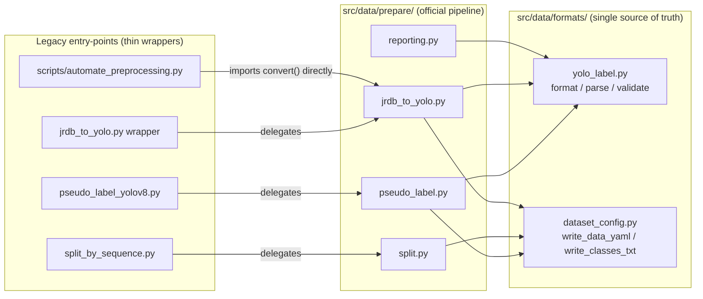
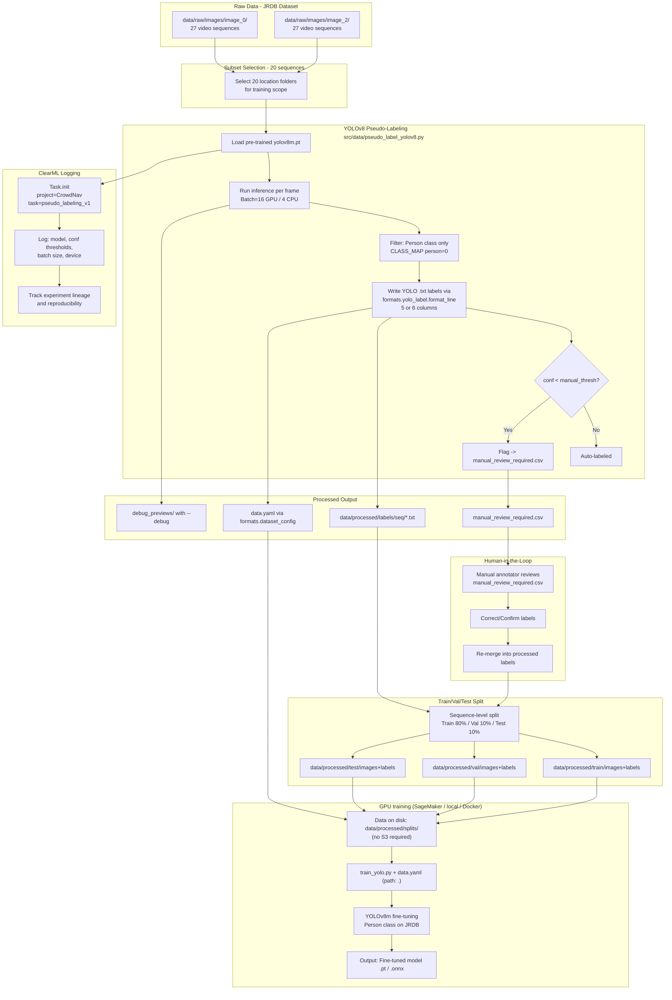

# Data Preprocessing Pipeline Diagram

This document explains the CrowdNav end-to-end data preprocessing pipeline in diagram form. It is structured so **AWS SageMaker** and **ClearML** stakeholders can see where they plug in.

---

## 0. Package Architecture (New)



---

## 1. High-Level Overview



---

## 2. Detailed Step-by-Step Description

### Step 1 — Raw Data (JRDB Dataset)
| Item | Description |
|---|---|
| Source | JRDB (JackRabbot Dataset) — Stanford campus video |
| Camera views | `image_0` (front), `image_2` (side) |
| Layout | Under each camera, 27 location/video sequence folders |
| Per folder | Consecutive frame images (`.jpg`) extracted from video |

> [!NOTE]
> `image_4`, `image_6`, `image_8`, `image_stitched` are out of scope for this training track (removed).

---

### Step 2 — Subset Selection
- **Goal:** Build an initial training set from 20 of 27 sequences (target subset size).
- **Current behavior:** Scripts iterate all of `image_0` and `image_2`.
- **Open item:** A explicit `sequence_subset.txt` list is not yet checked in (future work).

---

### Step 3 — YOLOv8 Pseudo-Labeling (`pseudo_label_yolov8.py`)

```
For each sequence in image_0/, image_2/:
  For each frame batch (size=16 GPU / 4 CPU):
    → yolov8m.pt inference (tracking)
    → Filter: class=person only
    → For each detection:
        line = formats.yolo_label.format_line(class_id, x, y, w, h, track_id)
        if any box has conf < manual_thresh → flag image for manual_review_required.csv
        all boxes still written to .txt (policy configurable)
    → After all sequences:
        → formats.dataset_config.write_data_yaml_from_class_map()
        → log to ClearML
```

**YOLO label format (`.txt`):**

| Col | Field | Description |
|---|---|---|
| 1 | `class_id` | Object class (person = 0) |
| 2–5 | `x, y, w, h` | Normalized box in [0, 1] |
| 6 | `track_id` | **(Optional)** track ID from BoT-SORT, controlled by `include_track_id` |

```
# Standard (5-col):
0 0.512000 0.634000 0.123400 0.245600

# Extended (6-col):
0 0.512000 0.634000 0.123400 0.245600 101
```
- Coordinates are relative to image size.
- `track_id` supports path/density analysis in later situational-awareness stages.
- Parsing/validation is centralized in `src/data/formats/yolo_label.py`.

---

### Step 4 — ClearML Logging

> **ClearML integration point**

ClearML records experiment metadata when the script runs.

```python
task = Task.init(project_name="CrowdNav", task_name="pseudo_labeling_v1")
task.connect(vars(args))
```

| Tracked field | Example |
|---|---|
| `model` | `yolov8m.pt` |
| `conf_thresh` | `0.4` |
| `manual_thresh` | `0.6` |
| `device` | `cuda` / `cpu` |
| effective batch | `16` (GPU) / `4` (CPU) |

**UI:** ClearML → Projects → CrowdNav → pseudo_labeling_v1

---

### Step 5 — Processed Output Files

| File | Purpose |
|---|---|
| `data/processed/labels/<seq>/*.txt` | YOLO labels for training |
| `manual_review_required.csv` | Low-confidence or review-needed frames |
| `data.yaml` | Dataset config (via `formats.dataset_config`) |
| `debug_previews/*.jpg` | Optional previews (`--debug`) |

---

### Step 6 — Train/Val/Test Split (`split_by_sequence.py`)

> **Downstream training consumes this output.**

```bash
# One run per camera view; --stem-prefix avoids filename collisions
python src/data/split_by_sequence.py \
  --src-labels data/processed/labels \
  --src-images data/raw/images/image_0 \
  --output-dir data/processed/splits \
  --stem-prefix image0 \
  --train-ratio 0.8 --val-ratio 0.1 --seed 42

python src/data/split_by_sequence.py \
  --src-labels data/processed/labels \
  --src-images data/raw/images/image_2 \
  --output-dir data/processed/splits \
  --stem-prefix image2 \
  --train-ratio 0.8 --val-ratio 0.1 --seed 42
```

**Output tree:**
```
data/processed/splits/
  train/
    images/
    labels/
  val/
    images/
    labels/
  test/
    images/
    labels/
  data.yaml   # training config (via formats.dataset_config)
```

---

### Step 7 — GPU training (no S3)

> **S3 is not required.** On **AWS SageMaker**, use a GPU notebook instance such as **ml.g4dn.xlarge** (NVIDIA T4), clone the repo onto the instance volume, and run `train_yolo.py` **directly on the instance**. The same script runs on a **local CUDA** machine.

- **Device:** If `--device` is omitted, `src/training/training_device.py` picks a CUDA GPU when available, otherwise CPU. Use `--device cpu` or `CROWDNAV_DEVICE=cpu` to force CPU.
- **Data:** Store `data/processed/splits/` on **EBS** (SageMaker), local disk, or a Docker volume.
- **Defaults:** `batch=16`, `workers=4` are a reasonable fit for **ml.g4dn.xlarge** (16 GB system RAM, T4 16 GB VRAM). Reduce batch if you hit OOM.

#### Path A: YOLO (Ultralytics) — same command for SageMaker **or** local CUDA

1. `cd train` (from repository root) and ensure repo-level `data/processed/splits/` with `data.yaml` (`path: .`).
2. Run (auto GPU when available; add `--device 0` to pin the first GPU):

```bash
python scripts/train_yolo.py \
  --model-cfg yolov8m.pt \
  --epochs 100 --batch 16 --workers 4
# Default --data-yaml resolves to <repo>/data/processed/splits/data.yaml
# Explicit GPU: --device 0
# Explicit CPU: --device cpu
```

#### Path B: Keras (COCO JSON) — optional skeleton

Place COCO JSON and image roots on the **same machine**, then:

```bash
python infra/train_keras_skeleton.py \
  --train-json /path/to/coco/train.json \
  --val-json /path/to/coco/val.json \
  --images-root /path/to/splits \
  --epochs 50 \
  --imgsz 640 \
  --batch 8
```

---

### Step 8 — Human-in-the-Loop (manual review)

`manual_review_required.csv` format:

```csv
image_path,lowest_confidence
data/raw/images/image_0/bytes-cafe-2019-02-07_0/frame_0001.jpg,0.612
data/raw/images/image_2/clark-center-2019-02-28_0/frame_0042.jpg,0.734
...
```

**Workflow:**
1. Open listed images and review quality.
2. Fix `.txt` labels or use a tool (e.g. LabelImg, Roboflow).
3. Write updates back to `data/processed/labels/` and re-run the split.

---

## 3. End-to-end flow summary

```
JRDB raw frames
    ↓
[pseudo_label_yolov8.py]  ← formats.yolo_label + formats.dataset_config
    ↓                          ↓
YOLO .txt labels         ClearML experiment log
    ↓
[split_by_sequence.py]    ← formats.dataset_config
    ↓
train / val / test splits + data.yaml
    ↓
[GPU host: EBS / local disk / Docker volume]
    ↓
[train_yolo.py]
    ↓
Fine-tuned YOLOv8 model (.pt / .onnx)
```
