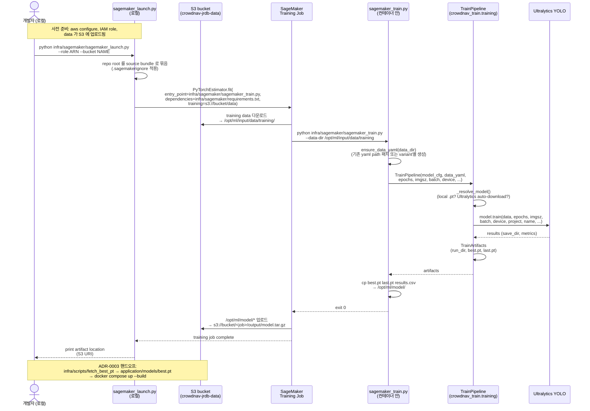
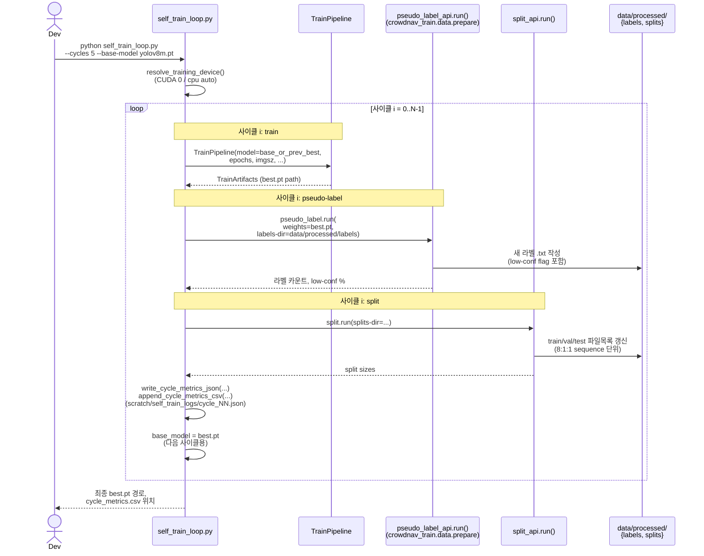

# Sequence Diagram — 학습 파이프라인 (SageMaker)

> 코드 grep 기반 다이어그램. ADR-0003 (Docker=webapp, SageMaker=training) 결정 후의 *intended* 학습 흐름.
> 출처: `infra/sagemaker/sagemaker_launch.py`, `infra/sagemaker/sagemaker_train.py`, `train/src/training/train_pipeline.py`, `train/scripts/self_train_loop.py`

## 1. 단일 학습 잡 (one-shot train)

가장 일반적인 경우. 사용자가 로컬에서 launcher 를 돌리고, SageMaker 가 클라우드에서 학습 후 `best.pt` 를 S3 로 회수.

## 2. Self-training 다중 사이클 (`self_train_loop.py`)

`train → pseudo-label → split` 한 사이클을 N 회 반복. `--cycles 5` 가 default. 각 사이클의 `best.pt` 가 다음 사이클의 base model 이 됨.

## 3. 핵심 contract 요약

| 입력 | 형식 | 출처 |
|---|---|---|
| training data | YOLO 디렉토리 (`train/images/`, `train/labels/`, `data.yaml`) | S3 (SageMaker) / `data/processed/splits/` (로컬) |
| base model | `.pt` checkpoint | Ultralytics 자동 다운로드 또는 직접 지정 |
| hyperparams | argparse CLI | 로컬: `train_yolo.py` / SageMaker: `sagemaker_launch.py` 의 `hyperparameters` |

| 출력 | 위치 (SageMaker) | 위치 (로컬) |
|---|---|---|
| `best.pt`, `last.pt` | `/opt/ml/model/` → S3 자동 업로드 | `runs/train/<name>/weights/` |
| 학습 메트릭 (`results.csv`) | `/opt/ml/model/` | 같은 폴더 |
| 학습 plot (PNG) | `/opt/ml/output/data/` (auxiliary) | `runs/train/<name>/` |

## 4. 미해결 디자인 결정 후보 (이 다이어그램 만들면서 식별)

- **모델 레지스트리**: SageMaker job 의 `best.pt` 를 webapp 에 어떻게 넘길지 — S3 직접 다운로드 vs ClearML model registry vs MLflow?
  → 후보 ADR: `ADR-0013-model-registry-handoff.md`
- **사이클 metric 위치**: 현재 `cycle_metrics.csv` 가 `scratch/self_train_logs/` 에 저장 (PROJECTS/CrowdNav 잔재 가능성). `runs/` 또는 ClearML 으로 일원화 필요
  → ADR-0004 (ClearML 정책) 와 묶어서 결정
- **ClearML 기록 시점**: 현재 `clearml_setup` 은 utils 에 분리. `TrainPipeline.train()` 안에서 자동 기록 vs 호출자가 명시적으로 기록?
  → ADR-0004 와 결합

## 5. 변경 이력

| 날짜 | 변경 | 작성자 |
|---|---|---|
| 2026-05-05 | 코드 grep 기반 1차 작성 (sagemaker_launch + sagemaker_train + TrainPipeline + self_train_loop) | Claude (Cowork mode) |
