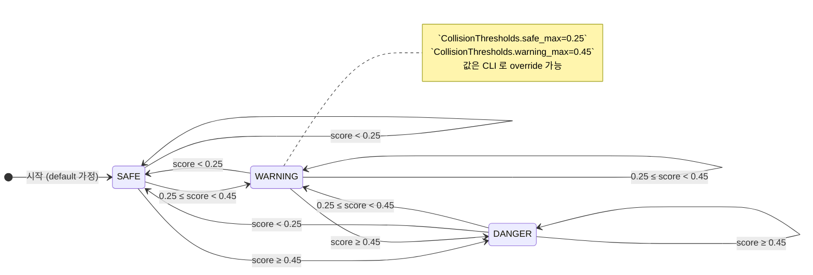
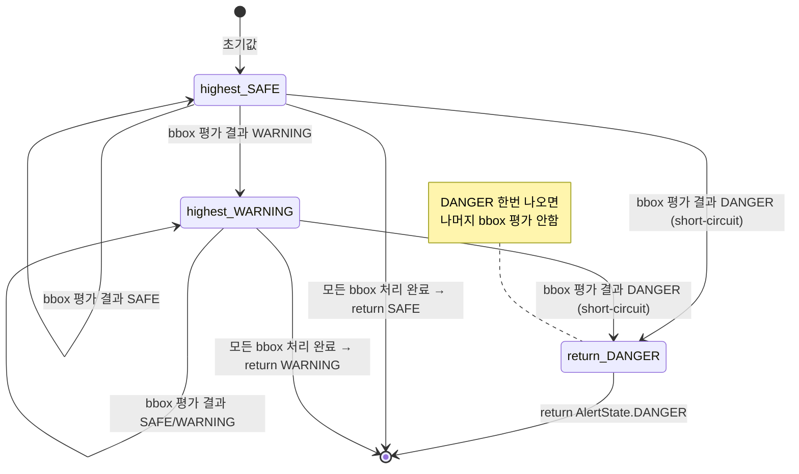
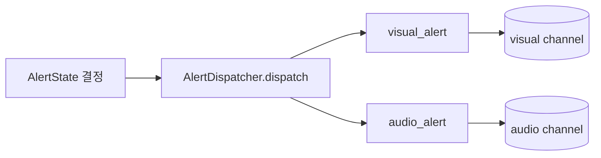

# Alert 상태 머신 (Collision Avoidance)

> 코드 grep 기반 다이어그램. 출처: `train/src/inference/collision_avoidance.py` (line 27-30 의 `AlertState` Enum, line 119-126 의 `evaluate()`, line 128-141 의 `evaluate_many()`)

## 1. 상태 정의

`AlertState` 는 **3개 discrete 상태** 의 `str Enum`. 코드 (`collision_avoidance.py:27-30`):

| 상태 | 의미 | 진입 조건 (proximity_score) |
|---|---|---|
| `SAFE` | 안전 | `score < safe_max` (default 0.25) |
| `WARNING` | 주의 | `safe_max ≤ score < warning_max` (default 0.45) |
| `DANGER` | 위험 | `score ≥ warning_max` |

`proximity_score` 는 metric 별로 다음 중 하나로 계산:
- `metric="height"` (default): `score = bbox.height`
- `metric="area"`: `score = clamp01(width × height)`
- `metric="hybrid"`: `score = clamp01(0.7 × height + 0.3 × area)`

## 2. State Diagram (단일 bbox)



> **메모**: 상태 전이는 *이력 의존성 없음*. 매 frame 마다 score 만으로 결정 (memoryless). hysteresis 가 없으므로 임계값 근처 jitter 가능.

## 3. State Diagram (다중 bbox — `evaluate_many()`)

여러 사람이 한 frame 에 있을 때 사용. 코드 (`collision_avoidance.py:128-141`):

```python
def evaluate_many(self, bboxes):
    highest = AlertState.SAFE
    for bbox in bboxes:
        current = self.evaluate(bbox)
        if current == AlertState.DANGER:
            return AlertState.DANGER   # short-circuit
        if current == AlertState.WARNING:
            highest = AlertState.WARNING
    return highest
```



## 4. Dispatcher 단계 (현재 미구현)

`AlertDispatcher` (`alert_dispatcher.py:9-30`) 는 skeleton — 모든 메서드가 `NotImplementedError` raise. 의도된 흐름은:



→ `dispatch(state)` 가 `visual_alert(state)` 와 `audio_alert(state)` 둘 다 호출하는 fan-out 구조.

→ **미해결 디자인 결정 후보**:
- `state` 가 동일하게 유지될 때도 매 frame `dispatch` 호출할지, 상태 *변화* 시점에만 발화할지 (debounce)
- visual/audio 채널이 무엇인지 (frontend SSE? OS 알림? 기기 진동?)
- → 후보 ADR: `ADR-0012-alert-dispatch-policy.md`

## 5. 임계값 검증 규칙

`CollisionThresholds.validate()` (`collision_avoidance.py:43-50`) 가 강제:
- `0.0 ≤ safe_max ≤ 1.0`
- `0.0 ≤ warning_max ≤ 1.0`
- `warning_max ≥ safe_max` (역전 금지)

위반 시 `ValueError` raise — runtime 에 잘못된 임계값으로 학습/추론 진행 방지.

## 6. 변경 이력

| 날짜 | 변경 | 작성자 |
|---|---|---|
| 2026-05-05 | 코드 grep 기반 1차 작성 (`collision_avoidance.py`, `alert_dispatcher.py`) | Claude (Cowork mode) |
