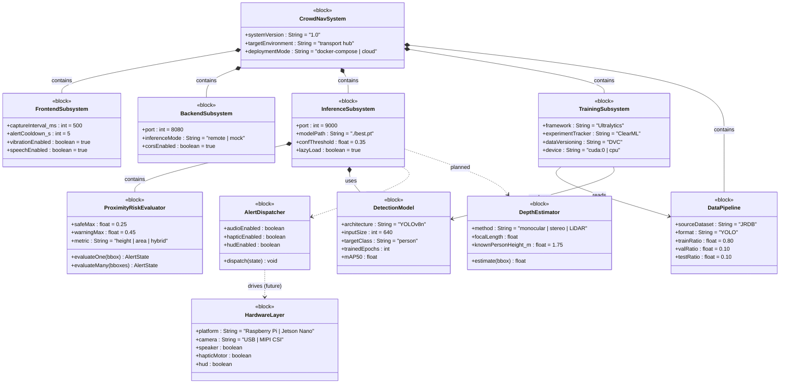
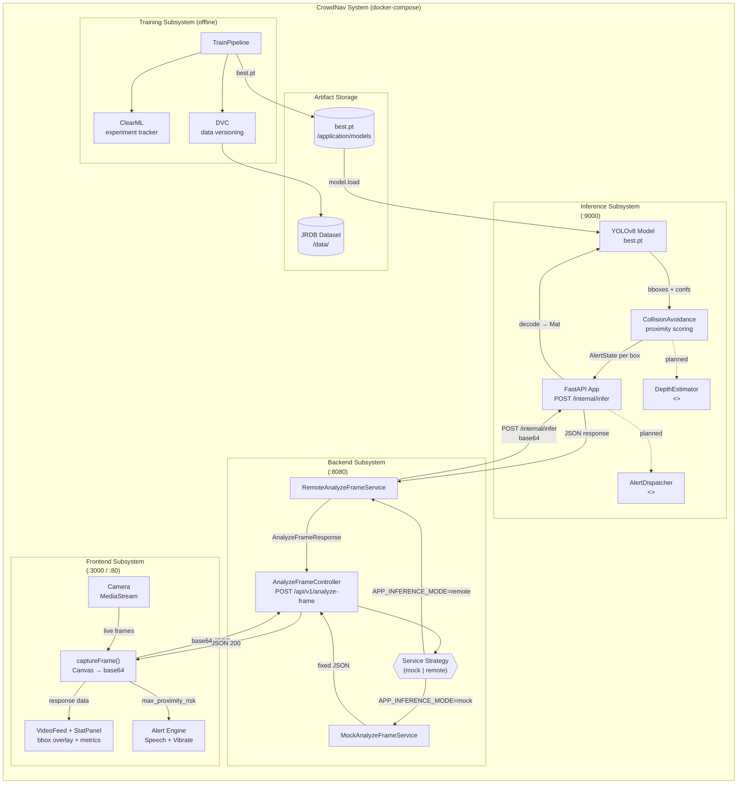

# SysML Diagrams — CrowdNav System

Four SysML view types are provided:
1. **Block Definition Diagram (BDD)** — system block hierarchy and properties
2. **Internal Block Diagram (IBD)** — connector/port wiring between blocks
3. **Use Case Diagram** — actors and system use cases
4. **State Machine Diagram** — alert state transitions

---

## SysML Diagram 1 — Block Definition Diagram (BDD)

> Shows the system decomposition into blocks, their value properties, and relationships.
> `<<block>>` stereotypes follow SysML v1.6 notation.



---

## SysML Diagram 2 — Internal Block Diagram (IBD)

> Shows how blocks are wired together through ports and connectors at runtime.



---

## SysML Diagram 3 — Use Case Diagram

```mermaid
flowchart LR
    subgraph Actors
        User(["👤 Wheelchair User"])
        MLOps(["👷 MLOps Engineer"])
        Admin(["🔧 System Admin"])
        ExtSensor(["📡 External Sensor\n<<future>>"])
    end

    subgraph CrowdNavSystem ["CrowdNav System"]
        UC1["Start Live Navigation\n(Camera + Analysis)"]
        UC2["Receive Proximity Alert\n(Audio + Haptic)"]
        UC3["View Crowd Statistics\n(Density + Risk panel)"]
        UC4["Stop Navigation Session"]

        UC5["Upload Training Data\n(DVC push)"]
        UC6["Run Training Pipeline\n(TrainPipeline.train)"]
        UC7["Track Experiment\n(ClearML)"]
        UC8["Deploy Updated Model\n(Docker build + push)"]

        UC9["Configure CORS / Ports"]
        UC10["Switch Inference Mode\n(mock ↔ remote)"]
        UC11["Monitor Health\n(GET /health)"]

        UC12["Depth-Aware Risk Fusion\n<<future>>"]
        UC13["Hardware Alert Dispatch\n<<future>>"]
    end

    User --> UC1
    UC1 --> UC2
    UC1 --> UC3
    User --> UC4

    MLOps --> UC5
    MLOps --> UC6
    UC6 --> UC7
    MLOps --> UC8

    Admin --> UC9
    Admin --> UC10
    Admin --> UC11

    ExtSensor -.->|"planned"| UC12
    UC12 -.->|"extends"| UC2
    UC12 -.->|"extends"| UC13
```



---

## SysML Diagram 4 — State Machine Diagram (Alert State)

> Models the lifecycle of the proximity alert state from the user's perspective,
> plus the concept-level hardware escalation path.

```mermaid
stateDiagram-v2
    [*] --> Idle : System starts

    Idle --> Scanning : User clicks START\ncamera stream active

    state Scanning {
        [*] --> SAFE

        SAFE --> WARNING : proximity_score ≥ 0.25\n(person approaching)
        WARNING --> SAFE : proximity_score < 0.25\n(person retreated)

        WARNING --> DANGER : proximity_score ≥ 0.45\n(imminent collision risk)
        DANGER --> WARNING : proximity_score < 0.45\n(risk reduced)
        DANGER --> SAFE : no persons detected

        state SAFE {
            [*] --> Monitor
            Monitor --> Monitor : capture every 500 ms
        }

        state WARNING {
            [*] --> PlayCaution
            PlayCaution --> Throttle : SpeechSynthesis +\nvibrate([200,100,200])
            Throttle --> Monitor_W : cooldown 5 s
            Monitor_W --> Monitor_W : continue scanning
        }

        state DANGER {
            [*] --> PlayWarning
            PlayWarning --> Throttle_D : SpeechSynthesis +\nvibrate([200,100,200,100,400])
            Throttle_D --> Monitor_D : cooldown 5 s
            Monitor_D --> Monitor_D : continue scanning

            note right of PlayWarning
                Concept: also trigger
                hardware AlertDispatcher
                → Speaker + Haptic motor
                + HUD overlay (future)
            end note
        }
    }

    Scanning --> Idle : User clicks STOP\nstream released

    state "Concept: Hardware Escalation (future)" as HW {
        [*] --> HW_SAFE
        HW_SAFE --> HW_WARN : WARNING state
        HW_WARN --> HW_DANGER : DANGER state
        HW_DANGER --> HW_BRAKING : Persistent DANGER\n> 2 s (auto-brake)
        HW_BRAKING --> HW_DANGER : Risk clears
        HW_DANGER --> HW_WARN : Risk reduces
        HW_WARN --> HW_SAFE : SAFE restored
    }

    Scanning ..> HW : planned integration
```

---

## SysML Diagrams Summary

| Diagram | SysML Type | Primary Audience | Current / Future |
|---------|-----------|-----------------|-----------------|
| BDD | Block Definition Diagram | System architect | Both |
| IBD | Internal Block Diagram | DevOps / integrator | Both |
| Use Case | Use Case Diagram | Stakeholders / PM | Both |
| State Machine | State Machine Diagram | Safety engineer | Both |

### Key SysML Properties Modelled

| Block | Value Properties |
|-------|-----------------|
| `InferenceSubsystem` | `confThreshold=0.35`, `port=9000`, `lazyLoad=true` |
| `ProximityRiskEvaluator` | `safeMax=0.25`, `warningMax=0.45`, `metric="height"` |
| `DetectionModel` | `architecture="YOLOv8n"`, `inputSize=640`, `targetClass="person"` |
| `FrontendSubsystem` | `captureInterval_ms=500`, `alertCooldown_s=5` |
| `TrainingSubsystem` | `framework="Ultralytics"`, `tracker="ClearML"`, `dvc="DVC"` |
| `DepthEstimator` `<<future>>` | `knownPersonHeight_m=1.75`, `method="monocular"` |
| `HardwareLayer` `<<future>>` | `platform="Jetson Nano"`, speaker, hapticMotor, hud |
