# UML Activity Diagrams — CrowdNav System

Three activity diagrams cover: (1) end-to-end runtime frame analysis, (2) data preparation & training pipeline, and (3) a concept-level adaptive alert workflow.

---

## Activity 1 — Runtime Frame Analysis (Current Implementation)

```mermaid
flowchart TD
    Start([User clicks START]) --> RequestCamera[Request device camera\nggetUserMedia video:true]
    RequestCamera --> CameraGranted{Camera\npermission?}

    CameraGranted -- Denied --> PermError[Show permission error\nto user]
    PermError --> EndError([END])

    CameraGranted -- Granted --> StartStream[Attach MediaStream\nto video element]
    StartStream --> StartLoop[Start 500 ms capture interval]

    StartLoop --> CaptureFrame[captureFrame\ncanvas.drawImage → toDataURL → base64]
    CaptureFrame --> SendAPI[POST /api/v1/analyze-frame\nframe_base64]

    SendAPI --> Validate{Backend:\nframe_base64\nvalid?}
    Validate -- No --> Return400[Return 400 Bad Request]
    Return400 --> LogError[Frontend logs error]
    LogError --> WaitNext[Wait for next interval]

    Validate -- Yes --> SelectService{Inference mode?}
    SelectService -- mock --> MockResponse[MockAnalyzeFrameService\nReturn fixed response]
    SelectService -- remote --> ForwardInfer[RemoteAnalyzeFrameService\nPOST /internal/infer]

    ForwardInfer --> DecodeFrame[Decode base64 → OpenCV image]
    DecodeFrame --> RunYOLO[YOLO inference\nconf ≥ 0.35, class = person]
    RunYOLO --> AnyPersons{Persons\ndetected?}

    AnyPersons -- No --> ZeroResponse[Return empty response\ncrowd_density=LOW\nrisk=SAFE\nrecommendation=PROCEED]
    AnyPersons -- Yes --> NormBoxes[Normalise bounding boxes\n→ x_center, y_center, w, h]

    NormBoxes --> EvalEach[For each person:\nCollisionAvoidance.evaluate bbox]
    EvalEach --> ScoreHeight[proximity_score =\nnorm_height of bbox]
    ScoreHeight --> MapState{Score\nthreshold?}
    MapState -- score < 0.25 --> SAFE[AlertState = SAFE]
    MapState -- 0.25 ≤ score < 0.45 --> WARN[AlertState = WARNING]
    MapState -- score ≥ 0.45 --> DANGER[AlertState = DANGER]

    SAFE --> AggregateRisk
    WARN --> AggregateRisk
    DANGER --> AggregateRisk[evaluate_many:\nworst AlertState = max_risk]

    AggregateRisk --> CalcDensity[_crowd_density\nbased on count + max_risk]
    CalcDensity --> CalcRec[_recommendation\nPROCEED / CAUTION / STOP]
    CalcRec --> BuildResponse[Build JSON response]

    ZeroResponse --> ReturnResponse
    MockResponse --> ReturnResponse
    BuildResponse --> ReturnResponse[Return AnalyzeFrameResponse\nto frontend]

    ReturnResponse --> UpdateUI[Update VideoFeed bounding boxes\n+ StatPanel metrics]
    UpdateUI --> CheckRisk{max_proximity\n_risk?}

    CheckRisk -- SAFE --> WaitNext
    CheckRisk -- WARNING --> Cooldown{Alert\ncooldown\n≥ 5 s?}
    CheckRisk -- DANGER --> Cooldown

    Cooldown -- No --> WaitNext
    Cooldown -- Yes --> Speech[SpeechSynthesis.speak\nalert message]
    Speech --> Vibrate[navigator.vibrate\nhaptic pattern]
    Vibrate --> WaitNext

    WaitNext --> UserStop{User clicks\nSTOP?}
    UserStop -- No --> CaptureFrame
    UserStop -- Yes --> StopStream[Stop MediaStream tracks\nclearInterval\ndata = null]
    StopStream --> End([END])
```



---

## Activity 2 — Data Preparation & Training Pipeline

```mermaid
flowchart TD
    StartTrain([MLOps: Start Training Pipeline]) --> DVCPull[dvc pull\nFetch images + annotations]
    DVCPull --> DataReady{Data\navailable?}

    DataReady -- No --> ManualLabel[Annotate new frames\nwith JRDB labels or CVAT]
    ManualLabel --> AutoLabelQ{Auto-label\nwith YOLOv8x?}

    AutoLabelQ -- Yes --> RunAutoLabel[AutoLabeler.label_folder\nconf_threshold = 0.6]
    RunAutoLabel --> FilterConf[Filter detections\nbelow confidence threshold]
    FilterConf --> WriteLabels[write_yolo_files\nSave .txt label files]
    WriteLabels --> DVCAdd[dvc add data/\ngit commit + dvc push]

    AutoLabelQ -- No --> ParseJSON[io_utils: load_json\nparse JRDB annotations]
    ParseJSON --> ConvertYOLO[converter.to_yolo\nAbsolute px → normalised YOLO]
    ConvertYOLO --> WriteLabels

    DataReady -- Yes --> SplitData

    DVCAdd --> SplitData[split.py\nTrain 80 / Val 10 / Test 10\nsequence-aware grouping]
    SplitData --> WriteDataYAML[write_data_yaml\nWrite data.yaml + classes.txt]
    WriteDataYAML --> ResolveDevice[resolve_training_device\nCUDA:0 or CPU]

    ResolveDevice --> InitClearML[init_clearml_task\nCreate experiment in ClearML]
    InitClearML --> LogHyperparams[log_hyperparams\nlr0, epochs, imgsz, batch ...]

    LogHyperparams --> RunTrain[TrainPipeline.train\nYOLO model.train]

    RunTrain --> EpochLoop{Epoch ≤\nmax_epochs?}
    EpochLoop -- Yes --> ForwardPass[Forward pass\nbatch images]
    ForwardPass --> ComputeLoss[Compute loss\nbox + cls + dfl]
    ComputeLoss --> Backprop[Backpropagation\n+ optimiser step]
    Backprop --> LogMetrics[log_metric\nepoch mAP50, loss]
    LogMetrics --> EarlyStop{Val loss\nno improvement\n> patience?}
    EarlyStop -- No --> EpochLoop
    EarlyStop -- Yes --> SaveBest[Save best.pt]
    EpochLoop -- No --> SaveBest

    SaveBest --> RunVal[TrainPipeline.validate\nFinal mAP50, mAP50-95]
    RunVal --> MeetThresh{mAP50\n≥ threshold?}

    MeetThresh -- No --> AdjustHyper[Adjust hyperparameters\nretry with new config]
    AdjustHyper --> RunTrain

    MeetThresh -- Yes --> ExportModel{Export\nformat?}
    ExportModel -- ONNX --> ExportONNX[model.export format=onnx]
    ExportModel -- TorchScript --> ExportTS[model.export format=torchscript]
    ExportModel -- PT only --> CopyWeights

    ExportONNX --> CopyWeights
    ExportTS --> CopyWeights
    CopyWeights[Copy best.pt →\napplication/models/best.pt]
    CopyWeights --> RebuildDocker[docker build & push\ncrowdnav-inference image]
    RebuildDocker --> Deploy[docker-compose up\nRestart inference service]
    Deploy --> EndTrain([Training Complete])
```



---

## Activity 3 — Concept: Adaptive Proximity Alert Workflow (Future)

> Integrates depth estimation and hardware alert dispatch — not yet implemented.

```mermaid
flowchart TD
    StartFuture([Frame received by inference service]) --> DecodeImg[Decode base64 → OpenCV frame]
    DecodeImg --> RunDetect[YOLOv8 detection\nclass = person, conf ≥ 0.35]

    RunDetect --> AnyDetected{Persons\nfound?}
    AnyDetected -- No --> ResetAlert[Reset alert state to SAFE\nClear displays]
    ResetAlert --> EndIter([Wait for next frame])

    AnyDetected -- Yes --> StartFusion[Begin multi-modal fusion\nper detected person]

    subgraph Fusion Loop [For each detected person]
        direction TB
        BBoxScore[Proximity score\nbased on bbox height] --> DepthEst[DepthEstimator.estimate\nbbox → real-world depth]
        DepthEst --> FuseScores[Fuse proximity_score + depth_score\nweighted combination]
        FuseScores --> LocalState[Assign local AlertState\nSAFE / WARNING / DANGER]
    end

    StartFusion --> Fusion Loop
    Fusion Loop --> AggAll[evaluate_many\nAggregate worst AlertState]

    AggAll --> TrajectoryQ{Track ID\navailable?}

    TrajectoryQ -- Yes --> TrajPredict[Predict collision trajectory\nbased on bbox motion delta\n<<future - tracking>>]
    TrajPredict --> AdjustState[Adjust AlertState\nif trajectory converging]
    AdjustState --> DispatchDecision

    TrajectoryQ -- No --> DispatchDecision{Final\nAlertState?}

    DispatchDecision -- SAFE --> SafeOut[AlertDispatcher.dispatch SAFE\nGreen HUD overlay\nNo audio / haptic]

    DispatchDecision -- WARNING --> WarnOut[AlertDispatcher.dispatch WARNING\nYellow HUD overlay\nAudio: Caution. Pedestrians nearby.\nHaptic: short double pulse]

    DispatchDecision -- DANGER --> DangerOut[AlertDispatcher.dispatch DANGER\nRed HUD flashing\nAudio: Warning! Please stop.\nHaptic: long urgent pattern\nAuto-brake signal to wheelchair controller]

    SafeOut --> LogTelemetry
    WarnOut --> LogTelemetry
    DangerOut --> LogTelemetry[Log telemetry\nalert_state, timestamp, person_count]

    LogTelemetry --> UpdateDashboard[Push metrics to monitoring dashboard\ncrowd_density, risk trend]
    UpdateDashboard --> EndIter
```

---

## Activity Diagram Summary

| Diagram | Scope | Key Decision Points |
|---------|-------|---------------------|
| Activity 1 — Frame Analysis | Runtime (current) | Camera permission, inference mode, per-person risk scoring, alert cooldown |
| Activity 2 — Training Pipeline | MLOps (current) | Auto-label vs manual, early stopping, mAP threshold gate, export format |
| Activity 3 — Adaptive Alert | Concept (future) | Multi-modal fusion, trajectory prediction, hardware dispatch channel |
