# UML Class Diagram — CrowdNav System

```mermaid
classDiagram
    direction TB

    %% ─────────────────────────────────────────
    %% FRONTEND (TypeScript / React)
    %% ─────────────────────────────────────────
    namespace Frontend {
        class App {
            -running : boolean
            -data : AnalyzeFrameResponse
            -videoRef : HTMLVideoElement
            -streamRef : MediaStream
            -intervalRef : number
            -lastSpokenRiskRef : string
            -lastAlertTimeRef : number
            +start() void
            +stop() void
            +captureFrame() string
            +triggerAlert(risk : string) void
        }
        class VideoFeed {
            +videoRef : HTMLVideoElement
            +data : AnalyzeFrameResponse
            +running : boolean
        }
        class StatPanel {
            +data : AnalyzeFrameResponse
        }
        class Controls {
            +running : boolean
            +onStart() void
            +onStop() void
        }
        class ApiClient {
            +baseURL : string
            +analyzeFrame(frameBase64 : string) Promise~AnalyzeFrameResponse~
        }
    }

    %% ─────────────────────────────────────────
    %% SHARED DATA TYPES (TypeScript)
    %% ─────────────────────────────────────────
    namespace SharedTypes {
        class BBoxTS {
            <<TypeScript>>
            +x_center : number
            +y_center : number
            +width : number
            +height : number
        }
        class PersonDetectionTS {
            <<TypeScript>>
            +class : string
            +confidence : number
            +bbox : BBoxTS
            +proximity_risk : ProximityRisk
        }
        class AnalyzeFrameResponse {
            +persons : PersonDetection[]
            +crowd_density : string
            +max_proximity_risk : string
            +recommendation : string
        }
        class ProximityRisk {
            <<enumeration>>
            SAFE
            WARNING
            DANGER
        }
    }

    %% ─────────────────────────────────────────
    %% SPRING BOOT BACKEND (Java)
    %% ─────────────────────────────────────────
    namespace Backend {
        class AnalyzeFrameController {
            -service : AnalyzeFrameService
            +analyzeFrame(request : AnalyzeFrameRequest) ResponseEntity
            +analyzeFrameMultipart(image : MultipartFile) ResponseEntity
        }
        class AnalyzeFrameService {
            <<interface>>
            +analyzeFrame(frameBase64 : String) AnalyzeFrameResponseJava
        }
        class MockAnalyzeFrameService {
            +analyzeFrame(frameBase64 : String) AnalyzeFrameResponseJava
        }
        class RemoteAnalyzeFrameService {
            -restClient : RestClient
            -inferenceBaseUrl : String
            +analyzeFrame(frameBase64 : String) AnalyzeFrameResponseJava
        }
        class AnalyzeFrameRequest {
            +frame_base64 : String
        }
        class AnalyzeFrameResponseJava {
            +persons : List~PersonDetectionJava~
            +crowd_density : String
            +max_proximity_risk : String
            +recommendation : String
        }
        class PersonDetectionJava {
            +detectedClass : String
            +confidence : double
            +bbox : BBoxJava
            +proximity_risk : String
        }
        class BBoxJava {
            +x_center : double
            +y_center : double
            +width : double
            +height : double
        }
        class WebConfig {
            +corsConfigurer() WebMvcConfigurer
        }
    }

    %% ─────────────────────────────────────────
    %% PYTHON INFERENCE SERVICE (FastAPI)
    %% ─────────────────────────────────────────
    namespace InferenceService {
        class FastAPIApp {
            +model : YOLO
            +conf_threshold : float
            +health() dict
            +infer(request : InferRequest) dict
        }
        class InferRequest {
            +frame_base64 : str
        }
        class CollisionAvoidance {
            +thresholds : CollisionThresholds
            +metric : str
            +proximity_score(bbox : list) float
            +evaluate(bbox : list) AlertState
            +evaluate_many(bboxes : list) AlertState
        }
        class CollisionThresholds {
            +safe_max : float = 0.25
            +warning_max : float = 0.45
        }
        class AlertState {
            <<enumeration>>
            SAFE
            WARNING
            DANGER
        }
        class DepthEstimator {
            <<future>>
            +focal_length : float
            +known_height : float
            +estimate(bbox : list) float
            +normalize(depth : float) float
        }
        class AlertDispatcher {
            <<future>>
            +visual_alert(state : AlertState) void
            +audio_alert(state : AlertState) void
            +dispatch(state : AlertState) void
        }
    }

    %% ─────────────────────────────────────────
    %% TRAINING PIPELINE (Python)
    %% ─────────────────────────────────────────
    namespace TrainingPipeline {
        class TrainPipeline {
            +model_cfg : str
            +data_yaml : str
            +epochs : int
            +imgsz : int
            +batch : int
            +device : str
            +train() TrainArtifacts
            +validate() dict
            +export(format : str) str
        }
        class TrainArtifacts {
            +run_dir : Path
            +best_weights : Path
            +last_weights : Path
            +raw_result : object
        }
        class AutoLabeler {
            +model_path : str
            +conf_threshold : float = 0.6
            +label_folder(img_dir : Path) dict
            +discover_image_folders(root : Path) list
        }
        class TrainingHyperParams {
            +lr0 : float
            +lrf : float
            +momentum : float
            +weight_decay : float
        }
    }

    %% ─────────────────────────────────────────
    %% DATA DOMAIN MODELS (Python)
    %% ─────────────────────────────────────────
    namespace DataDomain {
        class BoundingBox {
            +x_min : int
            +y_min : int
            +x_max : int
            +y_max : int
        }
        class AnnotationRecord {
            +image_key : str
            +class_name : str
            +bbox : BoundingBox
            +track_id : int
        }
        class YoloBox {
            +class_id : int
            +x_center : float
            +y_center : float
            +width : float
            +height : float
            +track_id : int
        }
        class CocoDataset {
            +images : List~CocoImage~
            +annotations : List~CocoAnnotation~
            +categories : List~CocoCategory~
            +to_coco_dict() dict
        }
    }

    %% ─────────────────────────────────────────
    %% RELATIONSHIPS
    %% ─────────────────────────────────────────

    %% Frontend internal
    App "1" --> "1" VideoFeed : renders
    App "1" --> "1" StatPanel : renders
    App "1" --> "1" Controls : renders
    App "1" --> "1" ApiClient : calls
    ApiClient ..> AnalyzeFrameResponse : deserialises
    AnalyzeFrameResponse "1" *-- "0..*" PersonDetectionTS
    PersonDetectionTS "1" *-- "1" BBoxTS
    PersonDetectionTS --> ProximityRisk

    %% Backend internal
    AnalyzeFrameController "1" --> "1" AnalyzeFrameService : injects (Strategy)
    AnalyzeFrameService <|.. MockAnalyzeFrameService : implements
    AnalyzeFrameService <|.. RemoteAnalyzeFrameService : implements
    AnalyzeFrameController ..> AnalyzeFrameRequest : receives
    AnalyzeFrameController ..> AnalyzeFrameResponseJava : returns
    AnalyzeFrameResponseJava "1" *-- "0..*" PersonDetectionJava
    PersonDetectionJava "1" *-- "1" BBoxJava

    %% Frontend ↔ Backend (REST)
    ApiClient ..> AnalyzeFrameController : HTTP POST /api/v1/analyze-frame

    %% Backend ↔ Inference (REST)
    RemoteAnalyzeFrameService ..> FastAPIApp : HTTP POST /internal/infer

    %% Inference internal
    FastAPIApp "1" --> "1" CollisionAvoidance : uses
    CollisionAvoidance "1" --> "1" CollisionThresholds
    CollisionAvoidance ..> AlertState : produces
    CollisionAvoidance ..> DepthEstimator : planned integration
    CollisionAvoidance ..> AlertDispatcher : planned integration

    %% Training
    TrainPipeline ..> TrainArtifacts : produces
    TrainPipeline "1" --> "1" TrainingHyperParams : configured by
    AutoLabeler ..> YoloBox : generates
    AnnotationRecord "1" *-- "1" BoundingBox
    CocoDataset "1" *-- "0..*" AnnotationRecord
```

> Scope: current implementation + concept-level extensions (marked `<<future>>`).



## Legend

| Marker | Meaning |
|--------|---------|
| `<<future>>` | Stubbed / concept-level — not yet implemented |
| `<<enumeration>>` | Enum type |
| `<<TypeScript>>` | Client-side type only |
| Dashed arrow (`..>`) | Dependency / usage |
| Solid arrow (`-->`) | Association |
| Diamond (`*--`) | Composition |
| Hollow triangle (`<|..`) | Interface realisation |

## Layer Summary

```
┌─────────────────────────────────────────────────────────┐
│  Frontend (React/TS)  ─── App, VideoFeed, StatPanel     │
├─────────────────────────────────────────────────────────┤
│  Backend (Spring Boot) ── Controller → Service Strategy  │
├─────────────────────────────────────────────────────────┤
│  Inference (FastAPI/Python) ── YOLO + CollisionAvoidance │
├─────────────────────────────────────────────────────────┤
│  Training Pipeline ── TrainPipeline, AutoLabeler         │
├─────────────────────────────────────────────────────────┤
│  Data Domain ── BoundingBox, AnnotationRecord, YoloBox   │
└─────────────────────────────────────────────────────────┘
```
