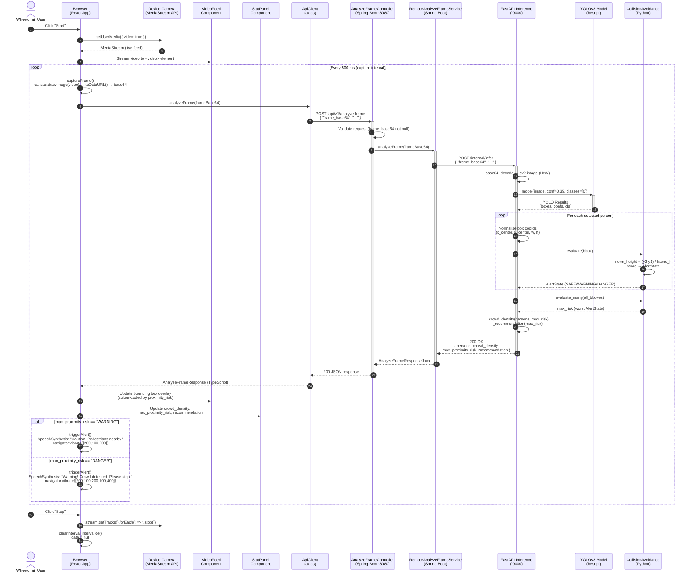
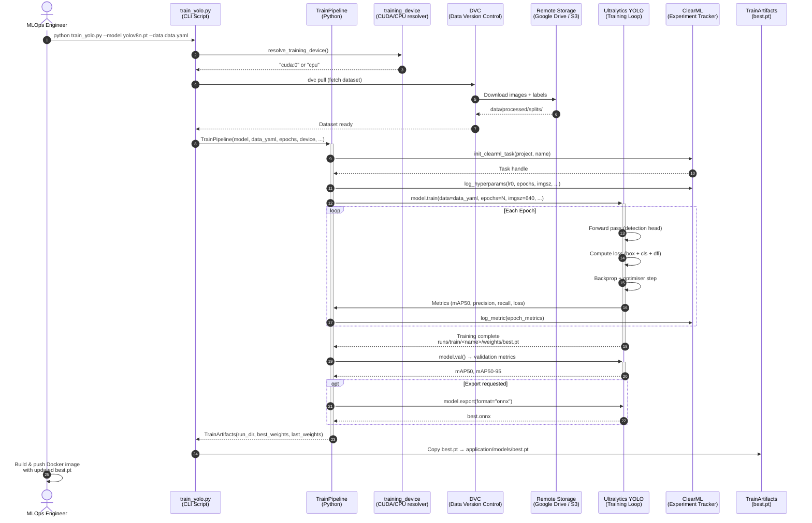
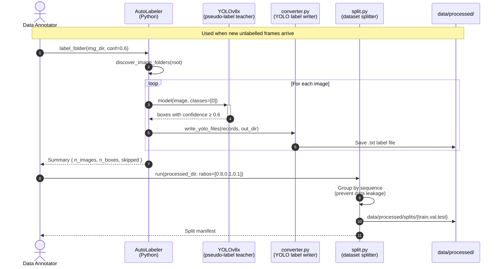
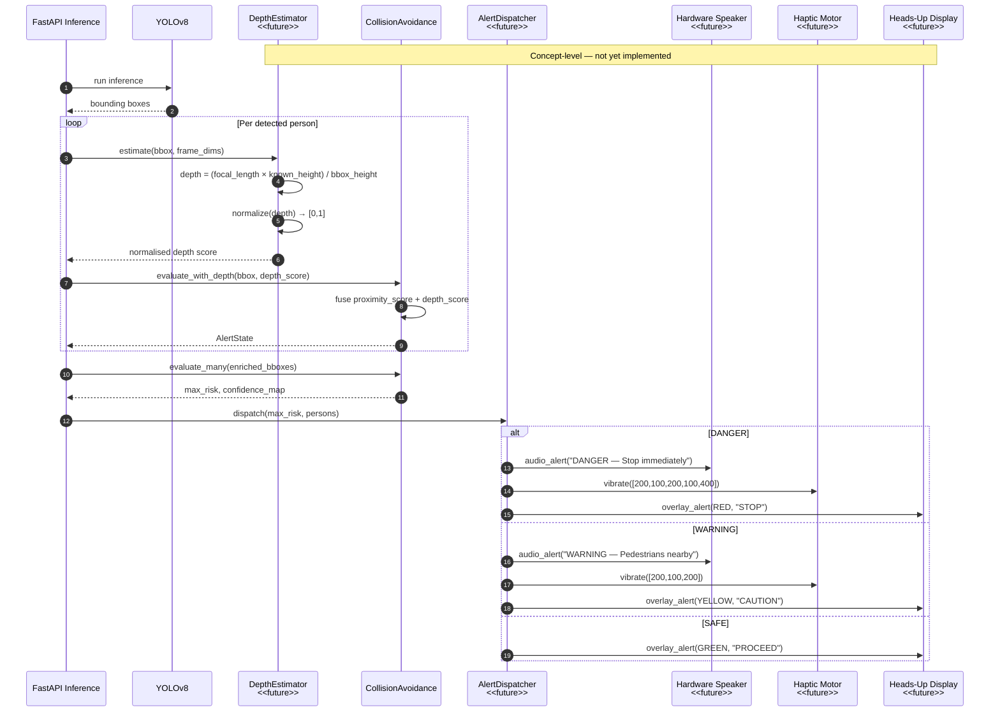

# UML Sequence Diagrams — CrowdNav System

Two scenarios are modelled:
1. **Primary Flow** — live frame analysis (current implementation)
2. **Concept-Level Flow** — with depth estimation and hardware alert output (planned)

---

## Sequence 1 — Live Frame Analysis (Current Implementation)

---

## Sequence 2 — Training Pipeline (MLOps)

---

## Sequence 3 — Auto-Labelling Pipeline (Concept-Level Extension)

---

## Sequence 4 — Concept: Depth-Aware Alert Dispatch (Future)

