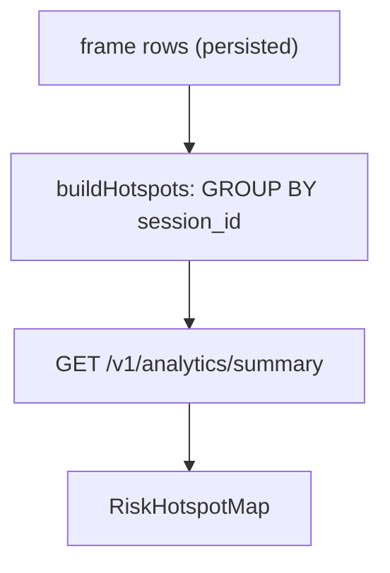

# Analytics — Risk Hotspot Map Gap Analysis

## Executive summary

The widget named **Risk Hotspot Map** on `/analytics` is the largest semantic gap in the S4 (FR-14) analytics dashboard. Users reasonably expect a **location-based risk map**; the implementation is a **session risk ranking visualization** — top sessions by DANGER frame count, placed on a decorative canvas with index-derived CSS coordinates.

**Actual behavior:** display the top 3 sessions (by `max_proximity_risk = DANGER` frame count) from the last *N* days on a non-geographic background.

**Better name for current behavior:** *Session Risk Ranking Visualization* (not *Risk Hotspot Map*).

Remediation fork: see [ADR-0011](../decisions/ADR-0011-risk-hotspot-widget-redesign.md) (Option A: rename/reshape vs Option B: real geo hotspot map).

Tracked as implementation gaps **G-7**, **G-8** in [`REQUIREMENTS.md`](../REQUIREMENTS.md) §6.1.

---

## Current behavior (code)

### Backend — `AnalyticsService.buildHotspots()`

```java
// Groups DANGER frames by session_id, ranks top 3, assigns fixed CSS positions by rank index
String top = (20 + index * 18) + "%";
String left = (25 + index * 22) + "%";
capacity = Math.min(99, (int) dangerFrames * 8) + "% CAPACITY"
```

Source: `application/backend/crowdnav-api/src/main/java/com/crowdnav/api/service/AnalyticsService.java`

### Frontend — `RiskHotspotMap`

- Renders markers at `top` / `left` from API response.
- Zoom, layer toggle, reset view — cosmetic only (no geographic data).
- Markers have `aria-label` but **no `onClick`** — no drill-down.

Source: `application/frontend/src/widgets/risk-hotspot-map/ui/RiskHotspotMap.tsx`

### Data flow



---

## Gap analysis

### 1. "Map" without geographic data — Critical

| Aspect | Detail |
|--------|--------|
| **Expected** | "Building A Lobby was dangerous → marker at lobby location" |
| **Actual** | "Rank #1 session → marker at fixed top-left slot" |
| **Impact** | Misread as location-based analysis; not actionable for facility layout |

Marker positions are **rank index**, not place:

```
rank 0 → top 20%, left 25%
rank 1 → top 38%, left 47%
rank 2 → top 56%, left 69%
```

---

### 2. Hotspot vs session ranking — Critical

| Aspect | Detail |
|--------|--------|
| **Aggregation unit** | `session_id` |
| **Not aggregated by** | `client_label`, zone, or geographic anchor |

Example: two sessions at "Building A Lobby" with 120 and 100 DANGER frames appear as **two separate hotspots** instead of one place total (220).

| Session | Place | Danger frames |
|---------|-------|---------------|
| A | Building A Lobby | 120 |
| B | Building A Lobby | 100 |
| C | Building B Hall | 110 |

**Current output:** A, C, B (session ranking).

**Place-based hotspot analysis would show:** Building A Lobby = 220, Building B Hall = 110.

---

### 3. DANGER frame count only — High

Only `max_proximity_risk == DANGER` is counted.

| Missing dimension | Example |
|-------------------|---------|
| **Duration** | 100 DANGER frames in 1 s can outrank 80 frames over 20 min |
| **Intensity** | All DANGER treated equally; no distance/proximity gradient within DANGER |

`detection.proximity_risk` per bbox exists in ERD but is not used in hotspot aggregation.

---

### 4. Misleading `capacity` metric — Critical

```java
Math.min(99, (int) dangerFrames * 8) + "% CAPACITY"
```

| User interpretation | Actual meaning |
|---------------------|----------------|
| Occupancy / congestion / capacity utilization | `danger_frame_count × 8` (capped at 99%) |

Example: 12 danger frames → **"96% CAPACITY"** — not 96% occupancy.

---

### 5. Top 3 limit — High

`LIMIT 3` after session ranking drops most of the risk distribution. Large facilities with many zones/sessions lose visibility into broader patterns.

---

### 6. Empty state UX — Medium

When no DANGER frames exist (or DB empty), the widget shows an **empty decorative map** with no explanatory copy.

Users cannot distinguish:

- no data in the selected period
- loading failure
- bug

**Needed:** explicit empty state, e.g. *"No hotspots detected during the selected period."*

---

### 7. Zoom / layer controls — Medium

Controls imply interactive geographic exploration. With fixed rank-based positions, zoom does not reveal additional information. **Map UI mimicry without map semantics.**

---

### 8. No drill-down — High

Analytics dashboards typically support:

```
Overview → Why? → Detail
```

Current flow:

```
Overview → end
```

No navigation to session archive, time range, or frame trail when a marker is selected.

---

### 9. No temporal dimension on widget — Medium

S4 goal: **weekly** density & risk analytics. The hotspot widget shows **who** (which session) was risky, not **when** patterns occurred (e.g. Monday 9–11, Friday peak).

Temporal analysis is partially available elsewhere (`PeakDensityChart`, `busiest_window`) but not on the hotspot widget.

---

### 10. Weak link to FR-14 travel-planning goal — High

S4 persona goal: plan travel / movement using analytics.

| Needed for decisions | Provided by hotspot widget alone |
|----------------------|----------------------------------|
| When risk peaks | No |
| How often | Partial (rank only) |
| Trend direction | No (see `WeeklySafetyScore`) |
| Recurring zones | No (session-level) |

**Other S4 widgets contribute more:** `PeakDensityChart`, `ZoneRiskDistribution`, `WeeklySafetyScore`.

---

## Severity summary

| Priority | Issue |
|----------|-------|
| Critical | Map name/UX vs non-geographic rank-based positions |
| Critical | Hotspot vs session ranking (wrong aggregation unit) |
| Critical | `capacity` mislabels danger-derived score |
| High | Duration/intensity not reflected |
| High | No drill-down |
| High | Top 3 information loss |
| Medium | Missing empty state |
| Medium | Zoom/layer low utility |
| Medium | No time-axis on widget |

---

## Data model constraints

From [`BACKEND_ERD.md`](../BACKEND_ERD.md):

| `analysis_session` column | Relevance |
|---------------------------|-----------|
| `client_label` | Free-text display label (e.g. `"demo-laptop"`) — **not normalized place** |
| `source_type` | `WEBCAM \| UPLOAD \| MOCK` — used by `buildZoneRisks`, not hotspots |
| *(none)* | No `lat`, `lng`, `zone_id`, or floor-plan coordinates |

A true geographic hotspot map requires schema and/or normalization work (ADR-0011 Option B).

`/live-map` uses hardcoded [`ZONE_ANCHORS`](../../application/frontend/src/features/live-map-markers/lib/mapMarkerUtils.ts) (UTS campus) — **not connected** to analytics hotspots.

---

## API contract drift (resolved in API_SPEC)

Prior to 2026-06-18, [`API_SPEC.md`](../API_SPEC.md) §5.1 showed `hotspots` with `name` / `count`. The implemented shape is [`HotspotItem`](../../application/backend/crowdnav-api/src/main/java/com/crowdnav/api/dto/analytics/HotspotItem.java): `id`, `label`, `capacity`, `risk`, `top`, `left`. See API_SPEC §5.1 semantics subsection.

---

## S4 widget value split

| Widget | Role in travel planning |
|--------|-------------------------|
| `PeakDensityChart` | **High** — when crowds peak |
| `ZoneRiskDistribution` | **High** — risk by source type |
| `WeeklySafetyScore` | **High** — overall trend |
| `RiskHotspotMap` | **Low (current)** — session rank on decorative canvas |

S4 API wiring is **Done**; hotspot **semantic accuracy** is not.

---

## Remediation options

See [ADR-0011](../decisions/ADR-0011-risk-hotspot-widget-redesign.md).

| | Option A — Rename & reshape | Option B — Real hotspot map |
|---|---|---|
| **Summary** | Replace with `Top Risk Sessions` list/chart; group by `client_label` | Add zone/geo model; MapLibre or floor plan; link to live-map anchors |
| **Scope** | Small FE + BE change | Schema migration + S3/S4 integration |
| **FR impact** | FR-14 response shape may change | FR-14 extension + shared model with FR-17 |

**No decision recorded yet** — implementation deferred to gap-implementation loop after ADR acceptance.

---

## Proposed acceptance criteria (future — not current requirements)

When ADR-0011 is accepted, candidate criteria:

1. Widget name matches behavior (geo map **or** explicit "session/place ranking").
2. Aggregation unit documented and correct (place vs session).
3. Metrics use accurate labels (no `capacity` for danger-frame scores).
4. Empty state when `hotspots.length === 0`.
5. Optional drill-down to `/archive` session detail.
6. Optional temporal breakdown per hotspot/place.
7. API_SPEC, REQUIREMENTS, and user_scenarios stay aligned.

---

## Related documents

| Document | Link |
|----------|------|
| ADR | [ADR-0011](../decisions/ADR-0011-risk-hotspot-widget-redesign.md) |
| Requirements gaps | [REQUIREMENTS.md](../REQUIREMENTS.md) §6.1 G-7, G-8 |
| S4 scenario | [user_scenarios.md](../runbooks/user_scenarios.md) § S4 |
| API semantics | [API_SPEC.md](../API_SPEC.md) §5.1 |
| UI audit backlog | [ui_design_audit.md](./ui_design_audit.md) AH-1 |
