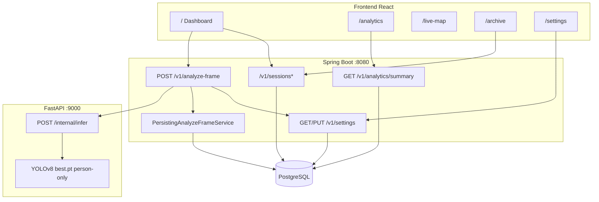

# CrowdNav User Scenarios — Code Flow & Legacy Mapping

Five end-to-end user scenarios mapped to routes, source files, APIs, implementation status, and legacy cleanup candidates.

## Intent mapping

| User intent | Scenario |
|-------------|----------|
| Wheelchair user navigating a crowded hub | **S1** Live monitoring |
| Persist session history | **S2** Archive |
| See position on a map | **S3** Live Map — browser GPS user marker |
| Avoid overcrowded areas | **S1** recommendation text + **S3** zone markers from session telemetry |

---

## System architecture (shared)



---

## Scenario summary

| ID | Scenario | Route | Data source | Status |
|----|----------|-------|-------------|--------|
| S1 | Real-time crowd & proximity avoidance | `/` | Live camera + YOLO API | **Done** |
| S2 | Session recording & archive review | `/archive` | PostgreSQL sessions API | **Done** |
| S3 | Map-based congestion avoidance | `/live-map` | GPS + session aggregates (24h poll) | **Partial** — zones anchored at UTS; risk from session DB |
| S4 | Weekly density & risk analytics | `/analytics` | `GET /v1/analytics/summary` + `useAnalyticsData` | **Done** |
| S5 | Alert & threshold settings | `/settings` | `GET/PUT /v1/settings` + inference thresholds | **Done** |

---

## S1 — Wheelchair user: real-time crowd & proximity avoidance

**Persona:** Traveller in a wheelchair at a train station or airport (PRD §4, `docs/diagrams/uml_sequence_diagram.md` Sequence 1).

**Goal:** Assess pedestrian density and proximity risk at ~2 FPS; act on PROCEED / CAUTION / STOP.

### User journey

1. Open `/` Dashboard → click **Start Monitoring**
2. Grant camera permission → live feed + colour-coded bboxes (SAFE=green, WARNING=yellow, DANGER=red)
3. Read StatsSidebar: people count, `crowd_density`, `max_proximity_risk`, `recommendation`
4. On WARNING/DANGER, optional speech + vibration (if enabled in Settings)
5. Click **Stop Monitoring** → camera released, panel cleared

### Code flow

| Step | Artifact |
|------|----------|
| Orchestration | `application/frontend/src/pages/dashboard/ui/DashboardPage.tsx` |
| Camera + 500 ms loop | `application/frontend/src/features/crowd-detection/model/useCrowdDetection.ts` |
| Layout | `widgets/dashboard-shell/`, `widgets/video-stage/`, `widgets/stats-sidebar/`, `widgets/control-bar/` |
| Alerts | `features/risk-alerts/`, `features/alert-history/` |
| API client | `shared/api/client.ts` → `analyzeFrame()` |
| Backend | `AnalyzeFrameController` → `RemoteAnalyzeFrameService` |
| Inference | `application/inference-service/main.py` — `_crowd_density()`, `_alert_state()`, `_recommendation()` |
| Proximity origin | `train/src/inference/collision_avoidance.py` |

### API sequence

```
POST /api/v1/sessions          (on Start — source_type WEBCAM)
POST /api/v1/analyze-frame     (every 500 ms, optional session_id)
  → POST /internal/infer       (FastAPI + YOLO)
PATCH /api/v1/sessions/{id}    (on Stop)
```

### Status

Implemented (FR-1–5, FR-UI-1–6). Wheelchair **class detection not shipped** (person-only; FR-13 planned).

### Legacy candidates (remove after S1 validation)

| Path | Reason |
|------|--------|
| `features/stats/StatPanel.tsx` | Superseded by `StatsSidebar` |
| `features/controls/Controls.tsx` | Superseded by `ControlBar` |
| `features/video/VideoFeed.tsx` | Superseded by `VideoStage` |

---

## S2 — Session recording & archive review

**Persona:** Same user or carer reviewing when risk was highest.

**Goal:** Persist frame metadata (density, risk, bboxes) during monitoring; filter and preview later.

### User journey

1. On Start (S1), backend creates a `WEBCAM` session automatically
2. Each `analyze-frame` call includes `session_id` → async persist (no raw frames)
3. On Stop, session closed via `PATCH /sessions/{id}`
4. Open `/archive` → filter by date/risk/source → select session → view worst risk & threat distribution
5. **Export DATA** remains disabled (Coming soon)

### Code flow

| Step | Artifact |
|------|----------|
| Session lifecycle | `useCrowdDetection` — `createSession("WEBCAM")`, `closeSession()` |
| API | `shared/api/sessions.ts` |
| Archive page | `pages/archive/ui/ArchivePage.tsx` |
| List & filters | `features/session-archive/model/useSessionArchive.ts` |
| Preview stats | `features/session-archive/model/useSessionPreview.ts` |
| Backend persist | `PersistingAnalyzeFrameService`, `FramePersistenceService` |
| Schema | `docs/BACKEND_ERD.md` — `analysis_session`, `frame`, `detection` |

### Status

Implemented (FR-11, FR-12). NFR-9: raw frames not stored.

### Legacy candidates (remove after S2 validation)

| Path | Reason |
|------|--------|
| `features/archive-sessions/model/useArchiveSessions.ts` | Old hook; `ArchivePage` uses `useSessionArchive` |
| `features/archive-sessions/` | Re-export only; consolidate to `session-archive` |

---

## S3 — Map-based congestion avoidance (Live Map)

**Persona:** Wheelchair or elderly traveller near UTS Sydney / transport hub.

**Goal:** Spot congested zones (e.g. Zone A-4) on a map and choose a detour.

### User journey

1. Open `/live-map`
2. View MapLibre + OpenFreeMap tiles with risk-coloured markers
3. See **Zone A-4 Congestion** (DANGER, 88% CAPACITY) → decide to avoid
4. *(Ideal, not implemented)* Current GPS position shown on map

### Code flow

| Step | Artifact |
|------|----------|
| Page | `pages/live-map/ui/LiveMapPage.tsx` |
| Map widget | `widgets/live-map-stage/ui/LiveMapStage.tsx` |
| Marker data | `features/live-map-markers/model/useMapMarkers.ts` — hardcoded `MAP_MARKERS` |

### Status

**Partial — implemented (2026-06-18)**

- **GPS:** `useGeolocation` watches browser position; blue pulse marker on map.
- **Session telemetry:** `useMapMarkers` polls `GET /v1/sessions` + `GET /v1/sessions/{id}` every 10s for the last 24h; aggregates `worst_risk`, `frame_count`, and active sessions into zone `risk` / `capacity`.
- **Zone anchors:** Fixed UTS Sydney coordinates (no per-frame geo in DB yet).
- **PRD §9:** Turn-by-turn route selection remains **deferred**.

### Code flow (updated)

| Step | Artifact |
|------|----------|
| Geolocation | `features/geolocation/model/useGeolocation.ts` |
| Aggregation | `features/live-map-markers/lib/mapMarkerUtils.ts` |
| Hook | `features/live-map-markers/model/useMapMarkers.ts` |

| Path | Reason |
|------|--------|
| `widgets/live-map-view/` | Duplicate of `LiveMapStage`; unused |

### Future integration (not legacy deletion)

- Feed session aggregates or inference results into `useMapMarkers`
- Add Geolocation API user marker

---

## S4 — Weekly density & risk analytics

**Persona:** Facility manager or carer reviewing trends across sessions.

**Goal:** Use peak hours, zone risk, and weekly safety score to plan travel times.

### User journey

1. Open `/analytics`
2. Review RiskHotspotMap, WeeklySafetyScore, PeakDensityChart, ZoneRiskDistribution
3. Adjust travel plans using busiest window and zone risk data

### Code flow

| Step | Artifact |
|------|----------|
| Page | `pages/analytics/ui/AnalyticsPage.tsx` |
| Data | `features/analytics-data/model/useAnalyticsData.ts` → `GET /v1/analytics/summary` |
| API | `AnalyticsService` aggregates `frame` rows (peak hours, zone risks, hotspots) |
| Widgets | `risk-hotspot-map`, `weekly-safety-score`, `peak-density-chart`, `zone-risk-distribution` |

### Status

**Done (2026-06-18)** — charts and scores derive from PostgreSQL `frame` / session data for the selected window (`days=7` default).

### Legacy candidates (removed)

| Path | Reason |
|------|--------|
| `features/analytics-mock/` | Replaced by `analytics-data` + backend summary API |
| `features/analytics-dashboard/` | Orphan; page uses `analytics-data` |

---

## S5 — Pre-trip alert & threshold settings

**Persona:** User with different audible/haptic preferences.

**Goal:** Tune crowd density limit, audible alerts, and visual overlays.

### User journey

1. Open `/settings`
2. Adjust density limit and confidence in AlertThresholdsPanel
3. Toggle audible / vibration in SystemNotificationsPanel
4. Save → persisted to `app_settings` (PostgreSQL) with localStorage fallback

### Code flow

| Step | Artifact |
|------|----------|
| Page | `pages/settings/` |
| State | `features/sensor-settings/` → `GET/PUT /v1/settings` |
| Sensor list | Recent `WEBCAM` sessions from `GET /v1/sessions` |
| Inference link | `RemoteAnalyzeFrameService` / `MockAnalyzeFrameService` read settings → `conf_thresh`, `density_limit` on `/internal/infer` |
| Panels | `alert-thresholds-panel`, `detection-model-panel`, `sensor-sources-grid` |
| S1 link | `useRiskAlerts` reads audible toggle from settings |

### Status

**Done (2026-06-18)** — settings persist in DB; `confidence` and `density_limit` flow into YOLO inference per request. Model picker (`yolov8-precise` / `nano`) is stored but not yet mapped to separate weights.

### Legacy candidates (remove after S5 validation)

| Path | Reason |
|------|--------|
| `widgets/mobile-bottom-nav/` | Unused; `BottomNav` is canonical |
| `src/ui/Typography.tsx` | No `@/ui/` imports; `shared/ui` used |

---

## Legacy cleanup phases

### Phase A — Frontend orphans (after S1–S5 smoke + `npm test`)

| Path | Scenario |
|------|----------|
| `features/stats/`, `features/controls/`, `features/video/` | S1 |
| `widgets/live-map-view/` | S3 |
| `features/archive-sessions/` | S2 |
| `features/analytics-dashboard/` | S4 |
| `widgets/mobile-bottom-nav/`, `src/ui/Typography.tsx` | S5 |

### Phase B — Doc sync

- `docs/DESIGN.md` §9.7 FR-11 → PASS
- `docs/REQUIREMENTS.md` §4 session_id → implemented

### Phase C — Repo-level (`docs/architecture/LEGACY_CATALOG.md`)

Out of scope for scenario-driven cleanup (ADR required).

---

## Verification checklist

```
S1 [ ] Start Monitoring → camera on
S1 [ ] StatsSidebar crowd_density / recommendation updates
S1 [ ] Stop → camera off, stats cleared
S2 [ ] After S1 run → Archive shows session row
S2 [ ] Select session → preview stats + frame trail load
S3 [ ] /live-map → GPS marker + zone markers from session telemetry
S4 [ ] /analytics → charts render from DB summary API
S5 [ ] /settings → save persists via API; confidence affects analyze-frame
```

### Automated checks

```bash
cd application/frontend && npm test
docker compose -f application/docker-compose.yml ps   # all healthy
curl -s http://127.0.0.1:8080/actuator/health
```
